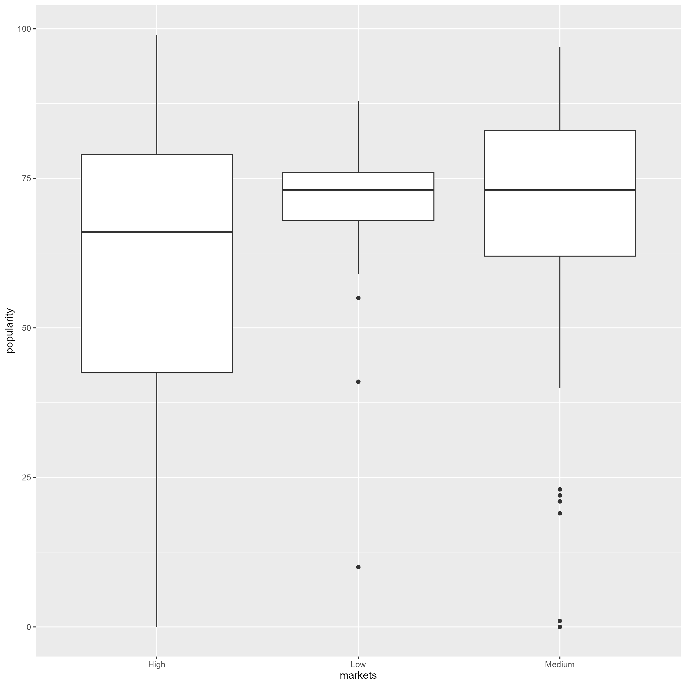
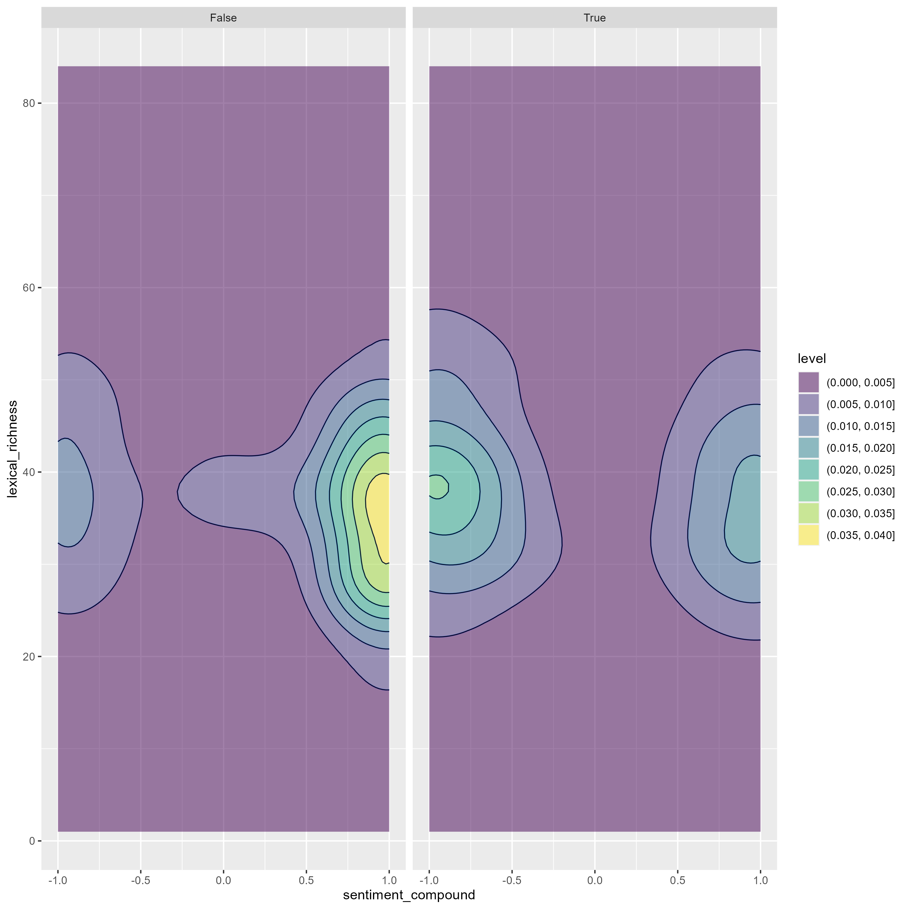
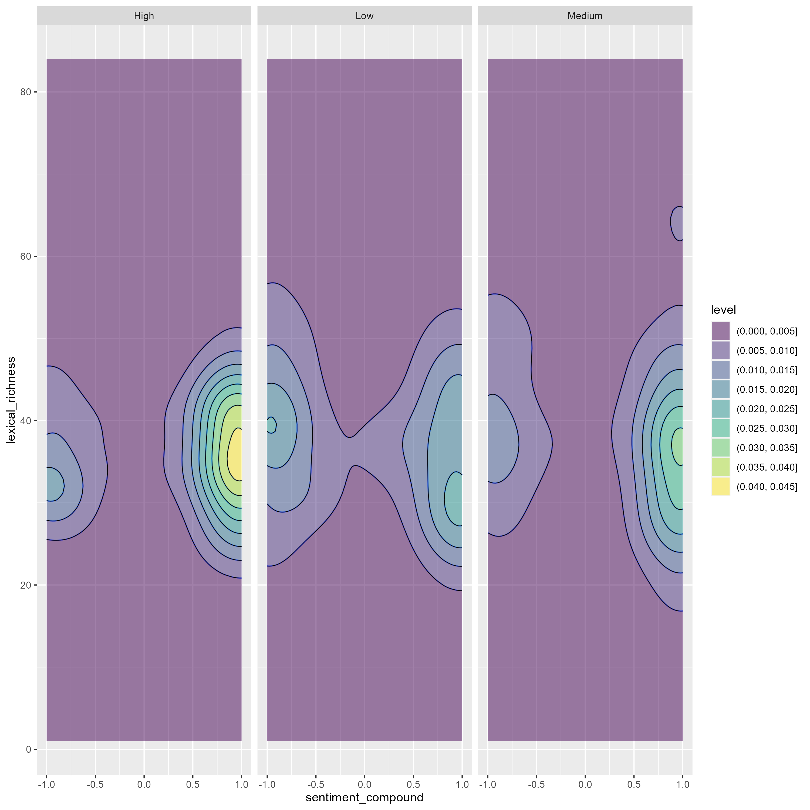
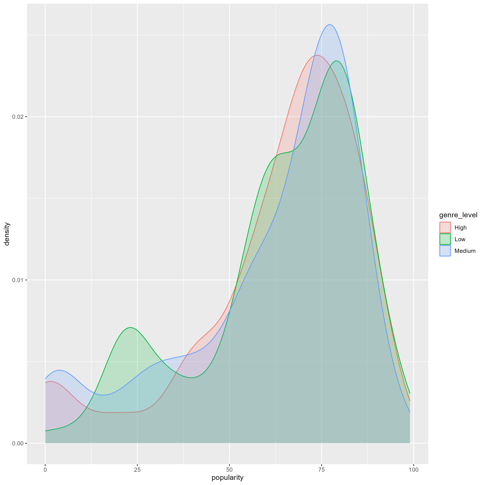
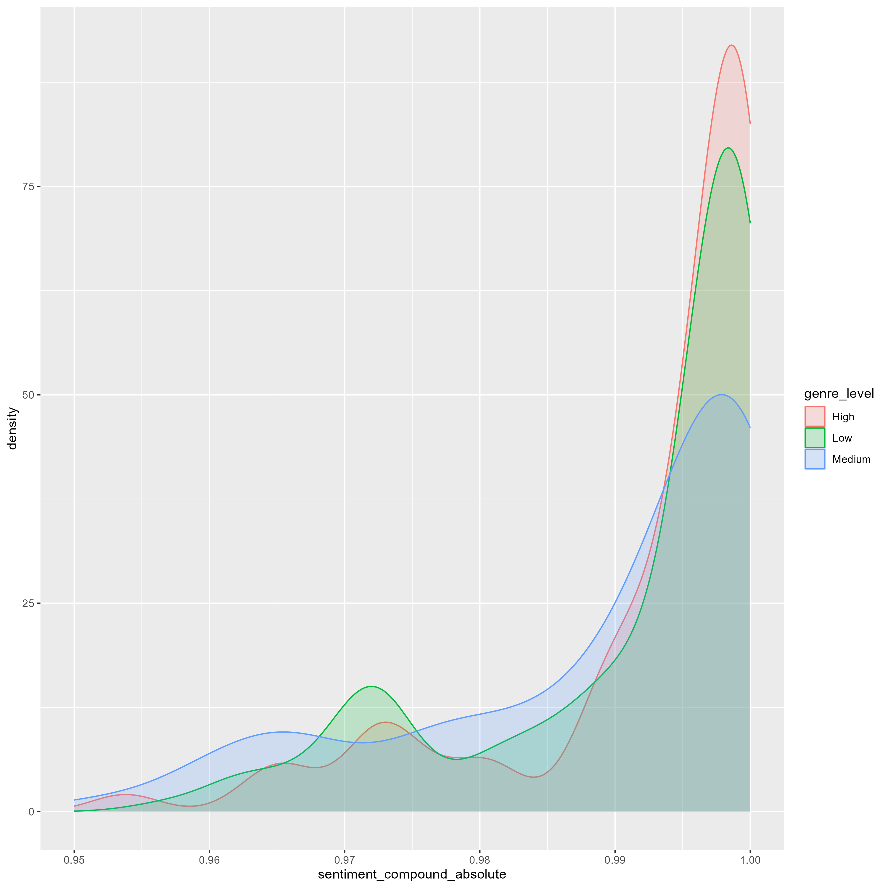

# DS105 Final Project – Music Metrics

_What type of music do AI models prefer? Algo-rhythms._


# What makes good music? 🎶

What makes good music? One's taste of music is a rather subjective matter: one's favourite music could very well be another's most hated song. It seems that music could be one of the worst topics for newbie data scientists to choose. But... we want to challenge ourselves, and see that if even something as abstract as music can be quantified using the prowess of knowledge in DS105. While music is an art, it can also be a science. While it will be naive for us to assume that music taste can be "solved", we believe that we can at least find some insights into the world of music, by simply applying basic data science principles. Let's dive in!

# Procurement Map 🔴🟡🟢🟣🔵

This is the breakdown of our overall approach. We have categorised our approach into different categories and colour-coded them. We have 🔴 for YouTube, 🟡 for Genius, 🟢 for Spotify, 🟣 for data expansion, and 🔵 for visualisation.


# Breakdown of our tools 🔴🟡🟢🟣🔵

Before we present our methodology, we will first present the tools (a surgeon needs to lay down the tools before commencing the operation). Our repository will consist of several parts, namely:
* Data folder: this include raw data for testing, and saved data
* Notebook folder: this will be mainly for pure coding work
* "DeeS tools" folder: this folder is where we store all our functions! We found a way to import them directly :smirk:

  ```python
  from dees_package.genius_functions import *
  ```
* Images folder: where we keep our images used for this website\

[insert screenshots of functions]
explain how we used package folders to streamline our code

# Our sources of data 🔴🟡🟢

There were a few options for us to source for data, the most popular ones being YouTube API, Spotify API and Genius. After some trial and error, we have concluded:

| Scope        | YouTube 🔴          | Spotify 🟢  | Genius 🟡 |
| :-------------|:-------------| :-----| :-----|
| **Type** | Mostly video contents, numbers of views or likes are good popularity indicators | A lot of content available, such as artist, song duration, genre etc. | Very useful platform for lyrics of songs |
| **Relevance** | Most data are not be relevant, except for popularity indicators such as likes or views | A wide range of data available, but API provides limited access | Highly relevant for lyrics scraping |
| **Technicality** | Most data are available, with high upper bound limit (10,000) | Hard to obtain specific data due to privacy reasons, only content such as genre can be determined | Difficult to use API, but easy to obtain lyrics via web scraping instead |

Hence, considering the strengths and weaknesses as a whole, we decided to use a combination of all 3

# YouTube API 🔴
For the Youtube API, we used three methods, namely the .search(), .videos(), and .commentThreads() methods. 

The .search() method is contained in the search_youtube() function and it acts just as its name suggests, we are basically inputting "official music video" into the YouTube search engine and getting the video IDs as our output. 

The methods are closely linked in our code, as the output of the search_youtube() function is used as the input for the get_stats() function and get_comments_in_videos() function which contains the .videos() and .commentThreads() methods. 

The .videos() method is used to obtain the statistics of the video, such as the number of views, likes, dislikes, comments etc. The .commentThreads() method is used to obtain the top few comments of the video.

We are able to obtain a dataframe containing the video ID, title, duration, views, likes, and the top few comments of the video after merging the outputs of both functions.

Example:

Using the search function to obtain the video IDs of the most popular music videos in the US: \
```youtube_search_data, video_id = search_youtube(service_youtube, 2000, "official music video", "video", "US", 10)```


# Genius 🟡

We used the Genius API and webscraping to scrape data on the Title, Artist and Lyrics of each song.

Beginning with the Video Title of the most popular music videos on YouTube, we first cleaned the video title to be standardised, such as removing "(Official Music Video)" from each title. We then used the Genius API to query Genius with the video title as the parameter. This allowed us to get the respective Title, Artist and URL of the Genius page for each song.

Since the API does not give us the lyrics of each song directly, we had to fall back on webscraping to get the lyrics. Using the URL of each Genius page, we ran a custom webscraping function to get the lyrics of each song as a single string, while also cleaning it to remove line breaks and section headers (such as [Bridge] or [Verse]). 

This enabled us to end up with cleaned data on the Title, Artist and Lyrics of each song, which we then merged together with the raw data collected from YouTube to form a final dataframe consisting of all the scraped data.

Example: 

Converting duration of song from minutes and seconds to only seconds \
```cleaned_df['duration'] = cleaned_df['duration'].apply(lambda x: isodate.parse_duration(x).total_seconds())```

# Spotify API 🟢

We leverage on the Spotify API to obtain an access token.

We then found a very useful `spotipy` package that is available. Using our access token and the package, we are able to use the `search()` tool to obtain a huge `json` format regarding a particular song. We then used [JSON Crack]([url](https://jsoncrack.com/)) to navigate the output and we are able to find insights such as a song's release date, popularity, explicitness and available markets.

# Data Expansion 🟣

Our current dataframe is cleaned and there are several factors that we can analyse already. However, we want to dive in deeper into our analysis and potentially create even more data for even better visualisation later on. Hence, we want to expand our dataframe further by looking at the following aspects.

|  **Aspect** | **Explanation**           |
| :------------------------ |:-------------|
| Song length | Most directly, given the lyrics, we are able to find the length of a song and it can be useful data. |
| Lexical richness | We want to have a sense of the range of vocabulary being used. To measure this quantitatively, we have identified a popular matrix called "lexical richness". In our definition, it is the proportion of unique words used of total words. |
| Sentiment analysis | We found the package `nltk` particularly useful for sentiment analysis. Given a particular lyric, we are able to determine the level of sadness, happiness, as well as an overall score for the sentiment called "sentiment compound". |
| Genre category | We noticed a significant lack of categories of a song based on Wikipedia search. Moreover, every song has a default category of "music", which is irrelevant. Hence, instead of working with small datapoints by having multiple categories of genres, we broadly categorised the songs into "Low", "Medium" or "High". This determines a rough level of "diversity" of a song by looking at _how many_, instead of _which_, genres the songs are in. |
| Market category | We have noticed that during an initial release of a song, the song is either in **(1)** all 184 markets, **(2)** slightly less than 184 markets, or **(3)** have very restricted markets (<50). Hence it is reasonable for us to categorise the songs into "Low", "Medium" or "High", where high category indicates less censorship/songs are more global in nature instead of local.|

# Visualisation 🔵

Once we have expanded our dataframe, we are able to have a wider range of data for visualisation purposes. Here is our final dataframe:

Dataframe

We used three different methodologies for data visualisation and analysis, namely:
* Statistical inference
* Univariate visualisation
* Multivariate visualisation

#### Statistical visualisation 🔵

We want to plot a general correlation matrix to look for any overall insights that we can find.


From the matrix, there are a few insights:
* Not surprisingly, view count, like count and comment count are all highly correlated, with like count and view count having the strongest correlation (0.91).
* Song length is negatively correlated with lexical richness (-0.36). This is a sign that as songs get longer, artists generally rely on previous verses instead of creating new words/phrases.
* The sentiment compound of YouTube comments have some correlation with the positive and negative song sentiment (~0.2, an unsurprising fact) but has little correlation with all other factors, confirming our initial hypothesis that it is not relevant (0 correlation with popularity).
* It could be surprising to some that popularity of a song is negatively correlated with lexical richness. This means that in general, people may prefer repetitive songs and focus less on the creativity of new lyrics.

#### Basic visualisation 🔵

From here, we used our correlation matrix to guide us some ideas for plots. However, our visualisation methodology is very much based on trial and error. We begin with some insights that we can find from basic visualisations:



* It may be surprising that songs that are released in all 184 markets tend to be less popular.
* It may be a sign that quantity is generally compromised at the expense of quality, and songs that "spread too thin" and go too global may be less popular. In contrary, songs that are targeted at only a few markets seem to have very consistent level of popularity, capturing their niche audience.


We know that like count and view count has the highest correlation. But are there any insights if we categorise the data? Here, we categorised into the number of genres that the songs are in. However, there seems to have no insights here. (We tried plotting with other categorisations such as "explicitness" and "markets", but the results are similar.)


What about some potential trends over time? From plot above, we can see that at a reasonable confidence interval (95%), explicit songs have become slightly less popular. This is a sign that people's underlying preference for explicit songs may be gradually shifting over time.


#### More complex visualisation 🔵

In this section, the visualisations will be more comparative in nature, where we obtain insights by comparing multiple factors.


Here we once again compare the level of explicitness over time. It is reasonable for us to assume that the "explicitness" category was not available prior to ~1990, hence we ignore the first portion of the graph. It is interesting to note that there are two "bull runs" of explicit songs. Around 2000, there could be a possible watershed event (wild guess: 911) which affected the song market so much that artists start to release more non explicit songs.


This graph presents a perspective of how the market availability of songs change over time. The first trend is that there is an exponential increase in number of songs over time, which is not surprising at all. What we found insightful here is that from year 2000 to around 2008, artists tend to release songs that only exist in very few markets. From 2008 onwards, there is a significant trend reversal where most songs are available in global markets. This could be an indicator of the shift in level of globalisation/cultural changes/censorship policies during that period.


Here, we experimented with heat maps instead to understand the sentiment compound of a song further, and see if it has anything to do with the lexical richness. Firstly, we realise that songs tend to be extreme - either happy or sad instead of neutral. Secondly, there seems to be more happy songs than sad ones. However, we want to dive in deeper and see if there are more insights:



When we further break down into level of explicitness - we see a much larger difference. Vast majority of songs that are non-explicit are happy songs. For songs that are explicit, the distinction is less obvious - there is a more even spread of happy and sad songs.



When we break down into genre level, we notice some distinct differences in terms of lexical richness. For songs that belong to multiple genres, happy songs tend to use a wider range of vocabulary than sad ones. Conversely, for simple songs which belong to a single genre, sad songs use a wider range of vocabulary instead.



It seems that the genre level can affect the nature of a song by quite a bit, so we hypothesised that it should affect a song's popularity as well. But does it? Surprisingly, we can see that the distribution is very similar for all songs regardless of whether they belong to a lot of genre or just one. This rejects our hypothesis that it has a significant effect on popularity.



But what about the sentiment of a song? Note that most songs tend to be extreme in terms of sentiments, hence we limit the x-axis from 0.95 onwards. Here we see a clear distinction of how genre level affects the "sentiment extremity" of a song. Songs belong to lots of genres have a much higher level of extreme sentiments than songs that only below to a few/one genre.

# Conclusion 🔥
* Bullet 1
* Bullet 2

# Acknowledgement of AI use 🤖

We have relied on ChatGPT on an occasional basis throughout our project. We used ChatGPT extensively on:
* Finding the right functions, and then reading official documentation afterwards
* Debugging
* Generating ideas

To provide some specific examples, these are some areas where we used ChatGPT:

|         | Example Prompt           | Rationale  |
| :------------- |:-------------| :-----|
| 🔴 | " Why am I unable to get more than 50 video IDs every time I run my search function? | We used ChatGPT to recommend a solution based on a part of the API documentation that we may have missed |
| 🔴 |  |   |
| 🟡 |  |  |
| 🟡 |  |   |
| 🟢 |  |  |
| 🟢 |  |  |
| 🟣 | "Brainstorm some ideas of how to analyse lyrics" | We used ChatGPT to brainstorm ideas, and then we crafted our own functions based on some of the ideas |
| 🟣 | "What are the ways to conduct sentiment analysis?" | ChatGPT will recommend nltk as one of the packages, then we will Google the actual package and read its documentation |
| 🔵 | "How to plot contour lines using ggplot2?" | ChatGPT will give an overall guidance, and we will read the actual documentation afterwards |
| 🔵 | "What are the effective ways to find correlations in a dataframe?"  | One of the answers is "correlation matrix". Then we will proceed to find a YouTube step-by-step tutorial of how to plot this nicely, with explanations |

# Finally... Some reflections

### We have quite a bit of weaknesses in this project...
* 🔴 We made a huge assumption since the start. As we are not going to do data analysis via millions of videos, we searched music videos under "Official Music Video" in YouTube, from US viewers specifically. That may be already a skewed sample to begin with.
* 🔴 We relied on Wikipedia to provide a song's genre. However, there is a significant lack of such information on Wikipedia, which can fundamentally affect our data's reliability. Our intention was to utilise our W7 Summative skills but in reality it may not be a wise choice.
* 🟡 Web scraping is not the proper and ideal way to get Genius lyrics. We have to admit that even Genius itself do not advocate web scraping, and for data volume that is high (2000+) we are unsure if our scraper will work. We could have used other methods such as API instead, but it is much harder.
* 🟢 While we are able to obtain a wide variety of data, we failed to understand the intrinsic reliability of them. For example, spotify gives a popularity score of a song. But what defines popularity? What metrics/regression model does spotify use to determine a song's popularity? We do not know.
* 🟣 When analysing a song's sentiment, it can be very tricky. While nltk is a widely popular package being used, we do not know the fundamentals of how the package determines a string's sentiment. We assumed that the package is highly accurate and reflects a song's true sentiments, which is likely not the case.
* 🔵 When plotting certain graphs, we made an assumption that there are sufficient datapoints, which may not be the case. For example, especially at the tail-end of certain plots (such as popularity), the sample size becomes very small (estimated less than 50), which affects the reliability of our data.

### Moving forward...
* First of all, this project may have come to an end for DS105, but it is not the end for us. 
* We have found success in multiple areas – APIs, web-scraping, data manipulation. 😄
* But we have failed in others – building effective models, machine learning, or providing an *exhaustive* list of insights. 😢
* Therefore, we have decided that when we upgrade our coding skills, in particular: ❗
* Learning new languages
* Learning machine learning
* Taking higher-level statistics courses (beyond ST109)
* We are able to come back to this project and build a highly-advanced model that can truly understand music at the next level... 👀
* Till next time! 👋
