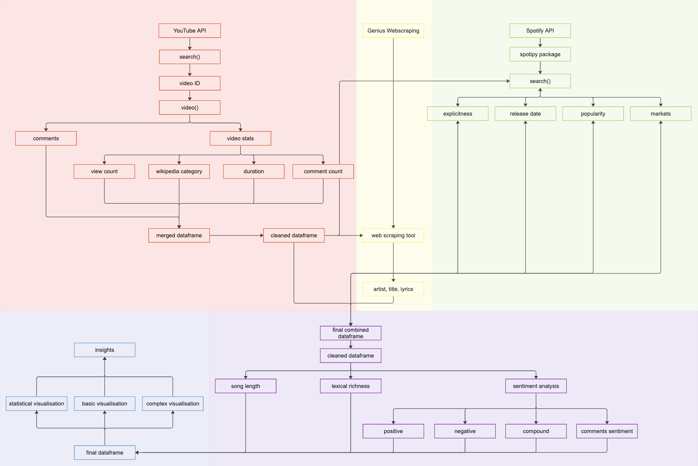
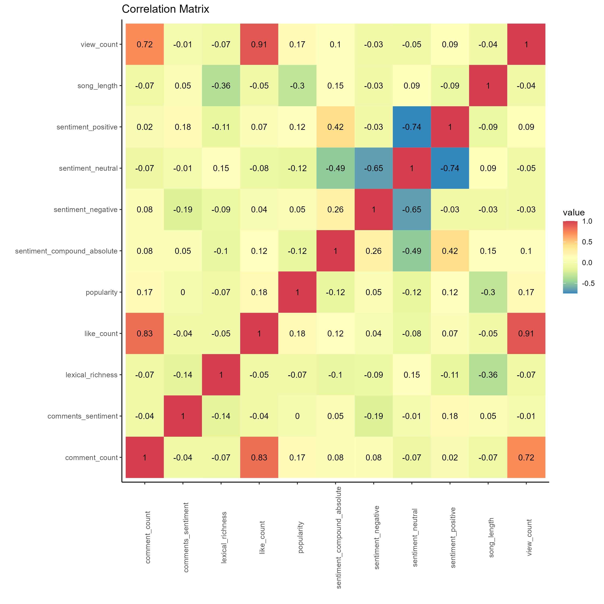
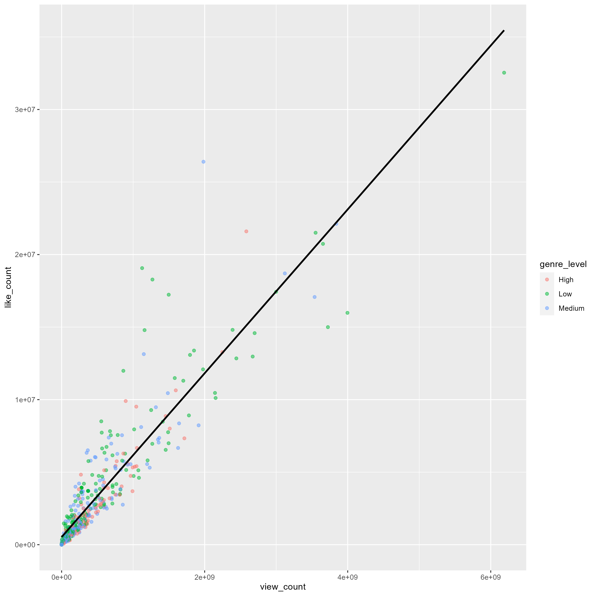
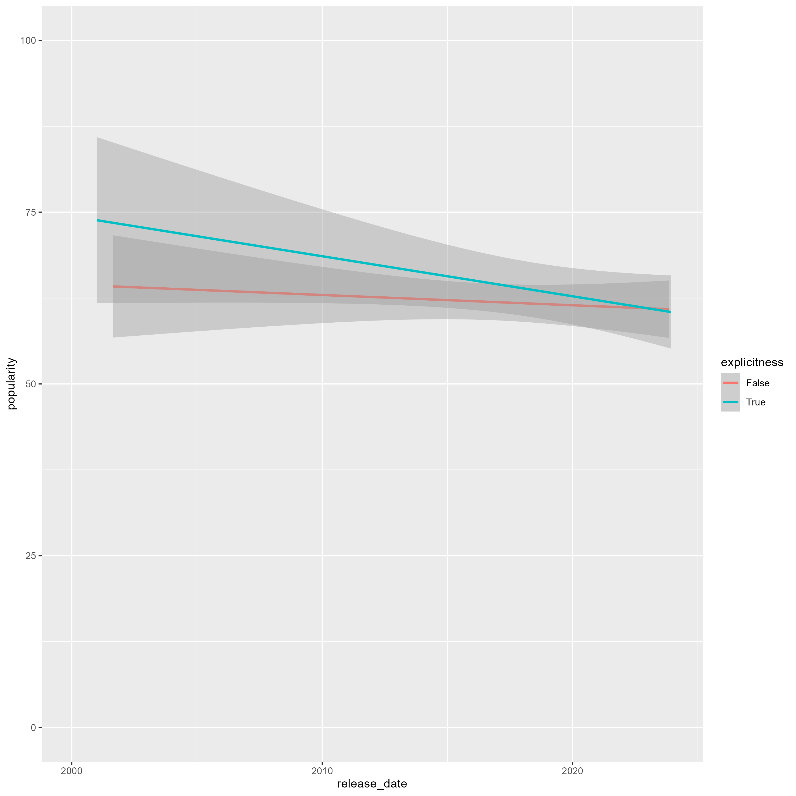
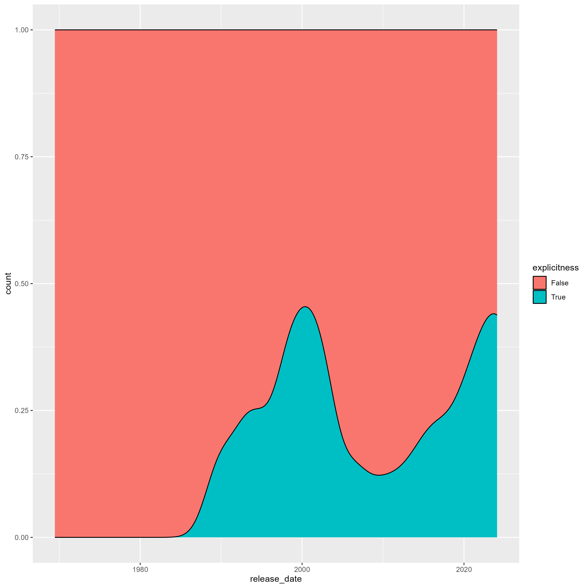
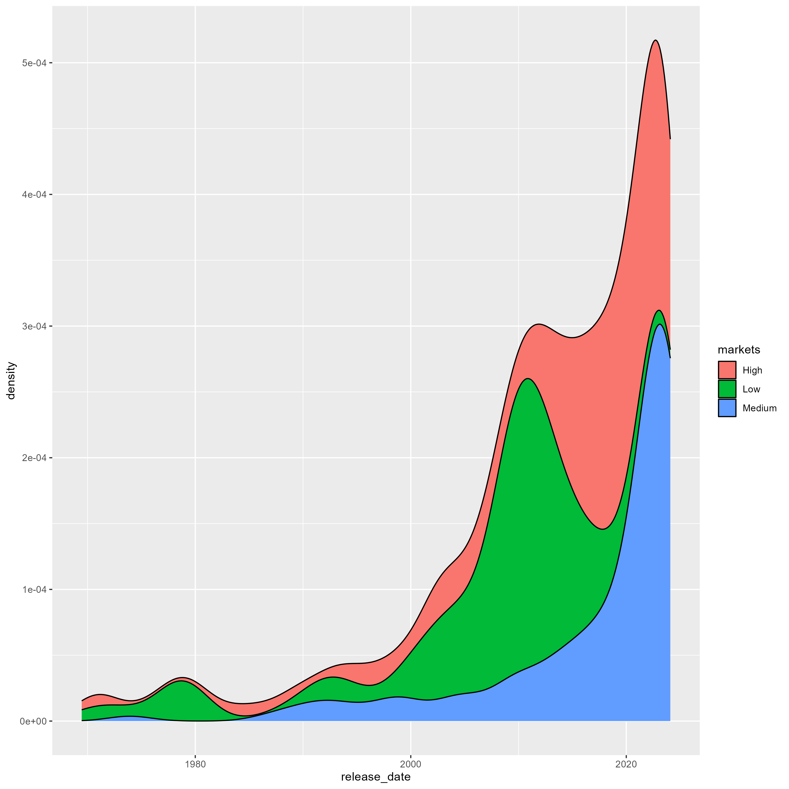
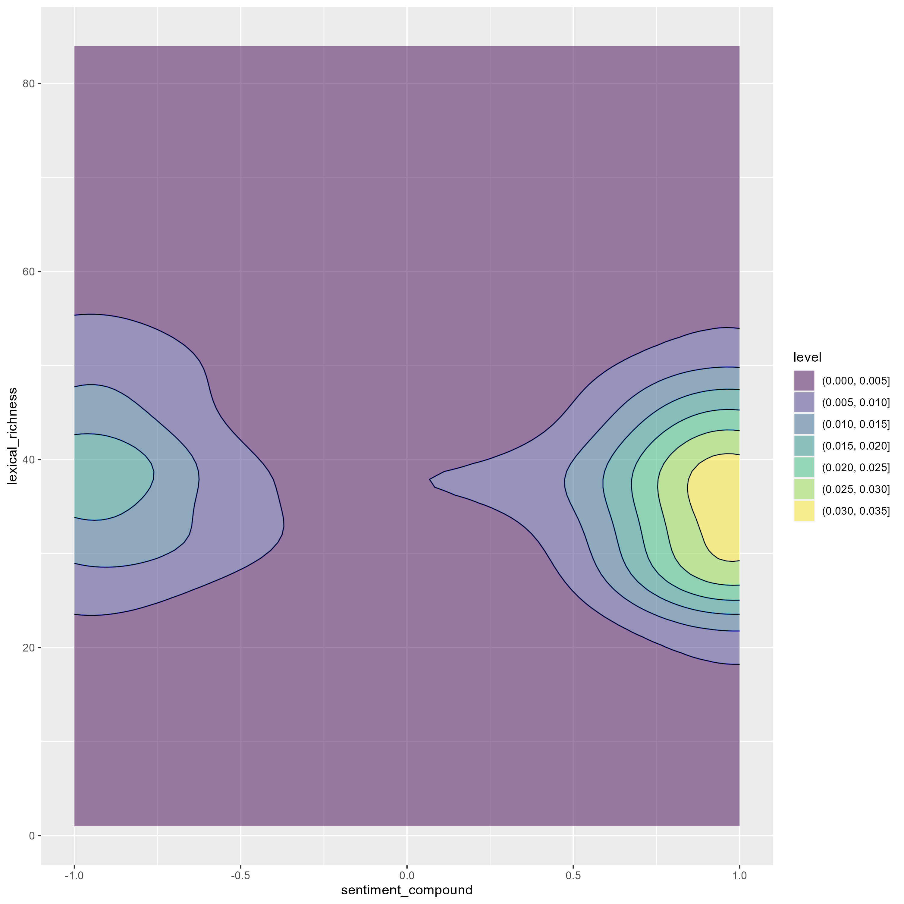

# DS105 Final Project – Music Metrics

_What type of music do AI models prefer? Algo-rhythms._

-------


*Despacito was the most popular music video in the US - but does that mean it is actually the best?*

# What makes good music? 🎶

What makes good music? One's taste of music is a rather subjective matter: one's favourite music could very well be another's most hated song. It seems that music could be one of the worst topics for newbie data scientists to choose. But... we want to challenge ourselves, and see that if even something as abstract as music can be quantified using the prowess of knowledge in DS105. While music is an art, it can also be a science. While it will be naive for us to assume that music taste can be "solved", we believe that we can at least find some insights into the world of music, by simply applying basic data science principles. Let's dive in!

# Procurement Map 🔴🟡🟢🟣🔵

This is the breakdown of our overall approach. We have categorised our approach into different categories and colour-coded them. We have 🔴 for YouTube, 🟡 for Genius, 🟢 for Spotify, 🟣 for data expansion, and 🔵 for visualisation.



# Breakdown of our tools 🔴🟡🟢🟣🔵

Before we present our methodology, we will first present the tools (a surgeon needs to lay down the tools before commencing the operation). Our repository will consist of several parts, namely:
* Data folder: this include raw data for testing, and saved data
* Notebook folder: this will be mainly for pure coding work
* "DeeS tools" folder: this folder is where we store all our functions! We found a way to import them directly :smirk:

  ```python
  from dees_package.genius_functions import *
  ```
* Images folder: where we keep our images used for this website\

[insert screenshots of functions]
explain how we used package folders to streamline our code

# Our sources of data 🔴🟡🟢

There were a few options for us to source for data, the most popular ones being YouTube API, Spotify API and Genius. After some trial and error, we have concluded:

| Scope        | YouTube 🔴          | Spotify 🟢  | Genius 🟡 |
| :-------------|:-------------| :-----| :-----|
| **Type** | Mostly video contents, numbers of views or likes are good popularity indicators | A lot of content available, such as artist, song duration, genre etc. | Very useful platform for lyrics of songs |
| **Relevance** | Most data are not be relevant, except for popularity indicators such as likes or views | A wide range of data available, but API provides limited access | Highly relevant for lyrics scraping |
| **Technicality** | Most data are available, with high upper bound limit (10,000) | Hard to obtain specific data due to privacy reasons, only content such as genre can be determined | Difficult to use API, but easy to obtain lyrics via web scraping instead |

Hence, considering the strengths and weaknesses as a whole, we decided to use a combination of all 3

# YouTube API 🔴
For the Youtube API, we used three methods, namely the .search(), .videos(), and .commentThreads() methods. 

The .search() method is contained in the search_youtube() function and it acts just as its name suggests, we are basically inputting "official music video" into the YouTube search engine and getting the video IDs as our output. 

The methods are closely linked in our code, as the output of the search_youtube() function is used as the input for the get_stats() function and get_comments_in_videos() function which contains the .videos() and .commentThreads() methods. 

The .videos() method is used to obtain the statistics of the video, such as the number of views, likes, dislikes, comments etc. The .commentThreads() method is used to obtain the top few comments of the video.

We are able to obtain a dataframe containing the video ID, title, duration, views, likes, and the top few comments of the video after merging the outputs of both functions.

Example:

Using the search function to obtain the video IDs of the most popular music videos in the US: \
```youtube_search_data, video_id = search_youtube(service_youtube, 2000, "official music video", "video", "US", 10)```


# Genius 🟡

We used the Genius API and webscraping to scrape data on the Title, Artist and Lyrics of each song.

Beginning with the Video Title of the most popular music videos on YouTube, we first cleaned the video title to be standardised, such as removing "(Official Music Video)" from each title. We then used the Genius API to query Genius with the video title as the parameter. This allowed us to get the respective Title, Artist and URL of the Genius page for each song.

Since the API does not give us the lyrics of each song directly, we had to fall back on webscraping to get the lyrics. Using the URL of each Genius page, we ran a custom webscraping function to get the lyrics of each song as a single string, while also cleaning it to remove line breaks and section headers (such as [Bridge] or [Verse]). 

This enabled us to end up with cleaned data on the Title, Artist and Lyrics of each song, which we then merged together with the raw data collected from YouTube to form a final dataframe consisting of all the scraped data.

Example: 

Converting duration of song from minutes and seconds to only seconds \
```cleaned_df['duration'] = cleaned_df['duration'].apply(lambda x: isodate.parse_duration(x).total_seconds())```

# Spotify API 🟢

We leverage on the Spotify API to obtain an access token.

We then found a very useful `spotipy` package that is available. Using our access token and the package, we are able to use the `search()` tool to obtain a huge `json` format regarding a particular song. We then used [JSON Crack]([url](https://jsoncrack.com/)) to navigate the output and we are able to find insights such as a song's release date, popularity, explicitness and available markets.

# Data Expansion 🟣

Our current dataframe is cleaned and there are several factors that we can analyse already. However, we want to dive in deeper into our analysis and potentially create even more data for even better visualisation later on. Hence, we want to expand our dataframe further by looking at the following aspects.

|  **Aspect** | **Explanation**           |
| :------------------------ |:-------------|
| Song length | Most directly, given the lyrics, we are able to find the length of a song and it can be useful data. |
| Lexical richness | We want to have a sense of the range of vocabulary being used. To measure this quantitatively, we have identified a popular matrix called "lexical richness". In our definition, it is the proportion of unique words used of total words. |
| Sentiment analysis | We found the package `nltk` particularly useful for sentiment analysis. Given a particular lyric, we are able to determine the level of sadness, happiness, as well as an overall score for the sentiment called "sentiment compound". |
| Genre category | We noticed a significant lack of categories of a song based on Wikipedia search. Moreover, every song has a default category of "music", which is irrelevant. Hence, instead of working with small datapoints by having multiple categories of genres, we broadly categorised the songs into "Low", "Medium" or "High". This determines a rough level of "diversity" of a song by looking at _how many_, instead of _which_, genres the songs are in. |
| Market category | We have noticed that during an initial release of a song, the song is either in **(1)** all 184 markets, **(2)** slightly less than 184 markets, or **(3)** have very restricted markets (<50). Hence it is reasonable for us to categorise the songs into "Low", "Medium" or "High", where high category indicates less censorship/songs are more global in nature instead of local.|

# Visualisation 🔵

Once we have expanded our dataframe, we are able to have a wider range of data for visualisation purposes. Here is our final dataframe:

|title                           |artist    |url                                                             |lyrics                                                                                                                                                                                                                                                                                                                                                                                                                                                                                                                                                                                                                                                                                                                                                                                                                                                                                                                                                                                                                                                                                                                                                                                                                                                                                                                                                                                                                                                                                                                                                                                                                                                                                                                                                                                                                                                                                                                                                                                                                                                                                                                                                                                                                                                                                                                                                                                                                                                                                                                                                                                                                                                                                                                                                                                                                                                                                                                                                                                                                                                                                                                                                                                                                                                                                                                                                                                                                                                                                                                                                                                                                                                                                                                                                                                                                                                                                                                                                                                                                                                                                                                                                                                                                                                                                                                                                                                                                                                                                                                                                                                                                                                                                                                                                                                                                                                                                                                                                                                                                                                                                                                                                                                                                                                                                                                                                                                                                                                                                                                                                                                                                                                                                                                                                                                                                                                                                                                                                                                                                                                                                                                                                                                                                                                                                                                                                                                                                                                                                                                                                                                                                                                                                                                                                                                                                                                                                                                                                                                                                                                                                                                                                                                                                                                                                                                                                                                                                                                                                                                                                                                                                                                                                                                                                                                                                                                                                                                                                                                                                                                                                                                                                                                                                                                                                                                                                                                                                                                                                                                                                                                                                                                                                                                                                                                                                                                                                                                                                                                                                                                                                                                                                                                                                                                                                                                                                                                                                                                                                                                                                                                                                                                                                                                                                                                                                                                                                                                                                                                                                                                                                                                                                                                                                                                                                                                                                                                                                                                                                                                                                                                                                                                                                                                                                                                                                                                                                                                                                                                                                                                                                                                                                                                                                                                                                                                                                                                                                                                                                                                                                                                                                                                                                                                                                                                                                                                                                                                                                                                                                                                                                                                                                                                                                                                                                                                                                                                                                                                                                                                                                                                                                                                                                                                                                                                                                                                                                                                                                                                                                                                                                                                                                                                                                                                                                                                                                                                                                                                                                                                                                                                                                                                                                                                                                                                                                                                                                                                                                                                                           |view_count|like_count|comment_count|genre_level|duration_seconds|comments_sentiment|sentiment_positive|sentiment_neutral|sentiment_negative|sentiment_compound|lexical_richness|song_length|sentiment_compound_absolute|release_date|popularity|explicitness|markets|
|--------------------------------|----------|----------------------------------------------------------------|-----------------------------------------------------------------------------------------------------------------------------------------------------------------------------------------------------------------------------------------------------------------------------------------------------------------------------------------------------------------------------------------------------------------------------------------------------------------------------------------------------------------------------------------------------------------------------------------------------------------------------------------------------------------------------------------------------------------------------------------------------------------------------------------------------------------------------------------------------------------------------------------------------------------------------------------------------------------------------------------------------------------------------------------------------------------------------------------------------------------------------------------------------------------------------------------------------------------------------------------------------------------------------------------------------------------------------------------------------------------------------------------------------------------------------------------------------------------------------------------------------------------------------------------------------------------------------------------------------------------------------------------------------------------------------------------------------------------------------------------------------------------------------------------------------------------------------------------------------------------------------------------------------------------------------------------------------------------------------------------------------------------------------------------------------------------------------------------------------------------------------------------------------------------------------------------------------------------------------------------------------------------------------------------------------------------------------------------------------------------------------------------------------------------------------------------------------------------------------------------------------------------------------------------------------------------------------------------------------------------------------------------------------------------------------------------------------------------------------------------------------------------------------------------------------------------------------------------------------------------------------------------------------------------------------------------------------------------------------------------------------------------------------------------------------------------------------------------------------------------------------------------------------------------------------------------------------------------------------------------------------------------------------------------------------------------------------------------------------------------------------------------------------------------------------------------------------------------------------------------------------------------------------------------------------------------------------------------------------------------------------------------------------------------------------------------------------------------------------------------------------------------------------------------------------------------------------------------------------------------------------------------------------------------------------------------------------------------------------------------------------------------------------------------------------------------------------------------------------------------------------------------------------------------------------------------------------------------------------------------------------------------------------------------------------------------------------------------------------------------------------------------------------------------------------------------------------------------------------------------------------------------------------------------------------------------------------------------------------------------------------------------------------------------------------------------------------------------------------------------------------------------------------------------------------------------------------------------------------------------------------------------------------------------------------------------------------------------------------------------------------------------------------------------------------------------------------------------------------------------------------------------------------------------------------------------------------------------------------------------------------------------------------------------------------------------------------------------------------------------------------------------------------------------------------------------------------------------------------------------------------------------------------------------------------------------------------------------------------------------------------------------------------------------------------------------------------------------------------------------------------------------------------------------------------------------------------------------------------------------------------------------------------------------------------------------------------------------------------------------------------------------------------------------------------------------------------------------------------------------------------------------------------------------------------------------------------------------------------------------------------------------------------------------------------------------------------------------------------------------------------------------------------------------------------------------------------------------------------------------------------------------------------------------------------------------------------------------------------------------------------------------------------------------------------------------------------------------------------------------------------------------------------------------------------------------------------------------------------------------------------------------------------------------------------------------------------------------------------------------------------------------------------------------------------------------------------------------------------------------------------------------------------------------------------------------------------------------------------------------------------------------------------------------------------------------------------------------------------------------------------------------------------------------------------------------------------------------------------------------------------------------------------------------------------------------------------------------------------------------------------------------------------------------------------------------------------------------------------------------------------------------------------------------------------------------------------------------------------------------------------------------------------------------------------------------------------------------------------------------------------------------------------------------------------------------------------------------------------------------------------------------------------------------------------------------------------------------------------------------------------------------------------------------------------------------------------------------------------------------------------------------------------------------------------------------------------------------------------------------------------------------------------------------------------------------------------------------------------------------------------------------------------------------------------------------------------------------------------------------------------------------------------------------------------------------------------------------------------------------------------------------------------------------------------------------------------------------------------------------------------------------------------------------------------------------------------------------------------------------------------------------------------------------------------------------------------------------------------------------------------------------------------------------------------------------------------------------------------------------------------------------------------------------------------------------------------------------------------------------------------------------------------------------------------------------------------------------------------------------------------------------------------------------------------------------------------------------------------------------------------------------------------------------------------------------------------------------------------------------------------------------------------------------------------------------------------------------------------------------------------------------------------------------------------------------------------------------------------------------------------------------------------------------------------------------------------------------------------------------------------------------------------------------------------------------------------------------------------------------------------------------------------------------------------------------------------------------------------------------------------------------------------------------------------------------------------------------------------------------------------------------------------------------------------------------------------------------------------------------------------------------------------------------------------------------------------------------------------------------------------------------------------------------------------------------------------------------------------------------------------------------------------------------------------------------------------------------------------------------------------------------------------------------------------------------------------------------------------------------------------------------------------------------------------------------------------------------------------------------------------------------------------------------------------------------------------------------------------------------------------------------------------------------------------------------------------------------------------------------------------------------------------------------------------------------------------------------------------------------------------------------------------------------------------------------------------------------------------------------------------------------------------------------------------------------------------------------------------------------------------------------------------------------------------------------------------------------------------------------------------------------------------------------------------------------------------------------------------------------------------------------------------------------------------------------------------------------------------------------------------------------------------------------------------------------------------------------------------------------------------------------------------------------------------------------------------------------------------------------------------------------------------------------------------------------------------------------------------------------------------------------------------------------------------------------------------------------------------------------------------------------------------------------------------------------------------------------------------------------------------------------------------------------------------------------------------------------------------------------------------------------------------------------------------------------------------------------------------------------------------------------------------------------------------------------------------------------------------------------------------------------------------------------------------------------------------------------------------------------------------------------------------------------------------------------------------------------------------------------------------------------------------------------------------------------------------------------------------------------------------------------------------------------------------------------------------------------------------------------------------------------------------------------------------------------------------------------------------------------------------------------|----------|----------|-------------|-----------|----------------|------------------|------------------|-----------------|------------------|------------------|----------------|-----------|---------------------------|------------|----------|------------|-------|
|Shape of You                    |Ed Sheeran|https://genius.com/Ed-sheeran-shape-of-you-lyrics               |A club isn't the best place to find a lover So the bar is where I go (Mm) Me and my friends at the table doin' shots Drinkin' fast and then we talk slow (Mm) And you come over and start up a conversation with just me And trust me, I'll give it a chance now (Mm) Take my hand, stop, put Van the Man on the jukebox And then we start to dance and now I'm singin' like Girl, you know I want your love Your love was handmade for somebody like me Well, come on now, follow my lead I may be crazy, don't mind me Say, "Boy, let's not talk too much" Grab on my waist and put that body on me Well, come on now, follow my lead Come, come on now, follow my lead, mm I'm in love with the shape of you We push and pull like a magnet do Although my heart is fallin' too I'm in love with your body And last night, you were in my room And now my bed sheets smell like you Every day, discoverin' somethin' brand new Well, I'm in love with your body Oh, I, oh, I, oh, I, oh, I Well, I'm in love with your body Oh, I, oh, I, oh, I, oh, I Well, I'm in love with your body Oh, I, oh, I, oh, I, oh, I Well, I'm in love with your body Every day, discoverin' somethin' brand new I'm in love with the shape of you One week in, we let the story begin We're goin' out on our first date (Mm) You and me are thrifty, so go all-you-can-eat Fill up your bag and I fill up a plate (Mm) We talk for hours and hours about the sweet and the sour And how your family is doin' okay (Mm) And leave and get in a taxi, and kiss in the back seat Tell the driver make the radio play and I'm singin' like Girl, you know I want your love Your love was handmade for somebody like me Well, come on now, follow my lead I may be crazy, don't mind me Say, "Boy, let's not talk too much" Grab on my waist and put that body on me Well, come on now, follow my lead Come, come on now, follow my lead, mm I'm in love with the shape of you We push and pull like a magnet do Although my heart is fallin' too I'm in love with your body And last night, you were in my room And now my bed sheets smell like you Every day, discoverin' somethin' brand new Well, I'm in love with your body Oh, I, oh, I, oh, I, oh, I Well, I'm in love with your body Oh, I, oh, I, oh, I, oh, I Well, I'm in love with your body Oh, I, oh, I, oh, I, oh, I Well, I'm in love with your body Every day, discoverin' somethin' brand new I'm in love with the shape of you Come on, be my baby, come on Come on, be my baby, come on Come on, be my baby, come on Come on, be my baby, come on Come on, be my baby, come on Come on, be my baby, come on Come on, be my baby, come on Come on, be my baby, come on I'm in love with the shape of you We push and pull like a magnet do Although my heart is fallin' too I'm in love with your body And last night, you were in my room And now my bed sheets smell like you Every day, discoverin' somethin' brand new Well, I'm in love with your body Come on, be my baby, come on Come on, be my baby, come on I'm in love with your body Come on, be my baby, come on Come on, be my baby, come on I'm in love with your body Come on, be my baby, come on Come on, be my baby, come on I'm in love with your body Every day, discoverin' somethin' brand new I'm in love with the shape of you                                                                                                                                                                                                                                                                                                                                                                                                                                                                                                                                                                                                                                                                                                                                                                                                                                                                                                                                                                                                                                                                                                                                                                                                                                                                                                                                                                                                                                                                                                                                                                                                                                                                                                                                                                                                                                                                                                                                                                                                                                                                                                                                                                                                                                                                                                                                                                                                                                                                                                                                                                                                                                                                                                                                                                                                                                                                                                                                                                                                                                                                                                                                                                                                                                                                                                                                                                                                                                                                                                                                                                                                                                                                                                                                                                                                                                                                                                                                                                                                                                                                                                                                                                                                                                                                                                                                                                                                                                                                                                                                                                                                                                                                                                                                                                                                                                                                                                                                                                                                                                                                                                                                                                                                                                                                                                                                                                                                                                                                                                                                                                                                                                                                                                                                                                                                                                                                                                                                                                                                                                                                                                                                                                                                                                                                                                                                                                                                                                                                                                                                                                                                                                                                                                                                                                                                                                                                                                                                                                                                                                                                                                                                                                                                                                                                                                                                                                                                                                                                                                                                                                                                                                                                                                                                                                                                                                                                                                                                                                                                                                                                                                                                                                                                                                                                                                                                                                                                                                                                                                                                                                                                                                                                                                                                                                                                                                                                                                                                                                                                                                                                                                                                                                                                                                                                                                                                                                                                                                                                                                                                                                                                                                                                                                                                                                                                                                                                                                                                                                                                                                                                                                                                                                                                                                                                                                                                                                                                                                                                                                                                                                                                                                                         |6187040943|32536757  |1150191      |Low        |264             |0.8388            |0.229             |0.757            |0.014             |0.9995            |23              |699        |0.9995                     |3/3/2017    |89        |FALSE       |High   |
|Sugar                           |Maroon 5  |https://genius.com/Maroon-5-sugar-lyrics                        |I'm hurting, baby, I'm broken down I need your loving, loving, I need it now When I'm without you, I'm something weak You got me begging, begging, I'm on my knees I don't wanna be needing your love I just wanna be deep in your love And it's killing me when you're away Ooh, baby 'Cause I really don't care where you are I just wanna be there where you are And I gotta get one little taste Your sugar, yes, please Won't you come and put it down on me? I'm right here, 'cause I need Little love, a little sympathy Yeah, you show me good loving, make it alright Need a little sweetness in my life Your sugar, yes, please Won't you come and put it down on me? Babe, my broken pieces, you pick them up Don't leave me hanging, hanging, come give me some When I'm without you, I'm so insecure You are the one thing, one thing I'm living for I don't wanna be needing your love I just wanna be deep in your love And it's killing me when you're away Ooh, baby 'Cause I really don't care where you are I just wanna be there where you are And I gotta get one little taste Sugar, yes, please Won't you come and put it down on me? I'm right here, 'cause I need Little love, a little sympathy Yeah, you show me good loving, make it alright Need a little sweetness in my life Your sugar, yes, please (Your sugar, yes, please) Won't you come and put it down on me? Yeah I want that red velvet, I want that sugar sweet Don't let nobody touch it unless that somebody's me I gotta be a man, there ain't no other way 'Cause girl, you're hotter than a Southern California day Never wanna play no games, you don't gotta be afraid Don't give me all that shy shit No makeup on, that's my sugar Sugar, yes, please (Please) Won't you come and put it down on me? (Down on me) I'm right here, 'cause I need (I'm right here, 'cause I need) Little love, a little sympathy Yeah, you show me good loving, make it alright Need a little sweetness in my life (Yeah) Your sugar, yes, please (Your sugar, yes, please) Won't you come and put it down on me? (Down on me) Sugar, yes, please Won't you come and put it down on me? (Down on me) I'm right here, 'cause I need (I'm right here, 'cause I need) Little love, a little sympathy Yeah, you show me good loving, make it alright Need a little sweetness in my life Your sugar, yes, please (Your sugar, yes, please) Won't you come and put it down on me? (Down on me, down on me, ooh)                                                                                                                                                                                                                                                                                                                                                                                                                                                                                                                                                                                                                                                                                                                                                                                                                                                                                                                                                                                                                                                                                                                                                                                                                                                                                                                                                                                                                                                                                                                                                                                                                                                                                                                                                                                                                                                                                                                                                                                                                                                                                                                                                                                                                                                                                                                                                                                                                                                                                                                                                                                                                                                                                                                                                                                                                                                                                                                                                                                                                                                                                                                                                                                                                                                                                                                                                                                                                                                                                                                                                                                                                                                                                                                                                                                                                                                                                                                                                                                                                                                                                                                                                                                                                                                                                                                                                                                                                                                                                                                                                                                                                                                                                                                                                                                                                                                                                                                                                                                                                                                                                                                                                                                                                                                                                                                                                                                                                                                                                                                                                                                                                                                                                                                                                                                                                                                                                                                                                                                                                                                                                                                                                                                                                                                                                                                                                                                                                                                                                                                                                                                                                                                                                                                                                                                                                                                                                                                                                                                                                                                                                                                                                                                                                                                                                                                                                                                                                                                                                                                                                                                                                                                                                                                                                                                                                                                                                                                                                                                                                                                                                                                                                                                                                                                                                                                                                                                                                                                                                                                                                                                                                                                                                                                                                                                                                                                                                                                                                                                                                                                                                                                                                                                                                                                                                                                                                                                                                                                                                                                                                                                                                                                                                                                                                                                                                                                                                                                                                                                                                                                                                                                                                                                                                                                                                                                                                                                                                                                                                                                                                                                                                                                                                                                                                                                                                                                                                                                                                                                                                                                                                                                                                                                                                                                                                                                                                                                                                                                                                                                        |3996606810|15982972  |420780       |Low        |302             |0.7498            |0.288             |0.642            |0.07              |0.9988            |29              |472        |0.9988                     |25/8/2020   |73        |TRUE        |High   |
|Waka Waka (This Time for Africa)|Shakira   |https://genius.com/Shakira-waka-waka-this-time-for-africa-lyrics|O-o-oh, e-e-e-e-e-eh Viva Africa ( Otra, otra ) Viva Africa ( Otra, otra ) Viva Africa ( Otra, otra ) Viva Africa ( Otra, otra ) You're a good soldier Choosing your battles Pick yourself up and dust yourself off Get back in the saddle You're on the front line Everyone's watching You know it's serious, we're getting closer This isn't over The pressure's on, you feel it But you got it all, believe it When you fall get up, oh, oh If you fall get up, eh, eh Tsamina mina zangalewa 'Cause this is Africa Tsamina mina, eh, eh Waka waka, eh, eh Tsamina mina zangalewa This time for Africa Listen to your God This is our motto Your time to shine, don't wait in line Y vamos por todo People are raising Their expectations Go on and feed them, this is your moment No hesitations Today's your day, I feel it You paved the way, believe it If you get down, get up, oh, oh When you get down, get up, eh, eh Tsamina mina zangalewa This time for Africa Tsamina mina, eh, eh Waka waka, eh, eh Tsamina mina zangalewa Anawa-a-a Tsamina mina, eh, eh Waka waka, eh, eh Tsamina mina zangalewa This time for Africa Awabuye lamajoni Ipikipiki mama wa A to Z Bathi susa lamajoni Ipikipiki mama from East to West Bathi waka waka mah, eh, eh Waka waka mah, eh, eh Zonk' izizwe mazibuye 'Cause this is Africa Tsamina mina Anawa-a-a Tsamina mina Tsamina mina Anawa-a-a Tsamina mina, eh, eh Waka waka, eh, eh Tsamina mina zangalewa Anawa-a-a Tsamina mina, eh, eh Waka waka, eh, eh Tsamina mina zangalewa This time for Africa Django, eh, eh Django, eh, eh Tsamina mina zangalewa Anawa-a-a Django, eh, eh Django, eh, eh Tsamina mina zangalewa Anawa-a-a This time for Africa This time for Africa We're all Africa ( Zama qhela ) We're all Africa ( Kwela kwela ) Zama qhela                                                                                                                                                                                                                                                                                                                                                                                                                                                                                                                                                                                                                                                                                                                                                                                                                                                                                                                                                                                                                                                                                                                                                                                                                                                                                                                                                                                                                                                                                                                                                                                                                                                                                                                                                                                                                                                                                                                                                                                                                                                                                                                                                                                                                                                                                                                                                                                                                                                                                                                                                                                                                                                                                                                                                                                                                                                                                                                                                                                                                                                                                                                                                                                                                                                                                                                                                                                                                                                                                                                                                                                                                                                                                                                                                                                                                                                                                                                                                                                                                                                                                                                                                                                                                                                                                                                                                                                                                                                                                                                                                                                                                                                                                                                                                                                                                                                                                                                                                                                                                                                                                                                                                                                                                                                                                                                                                                                                                                                                                                                                                                                                                                                                                                                                                                                                                                                                                                                                                                                                                                                                                                                                                                                                                                                                                                                                                                                                                                                                                                                                                                                                                                                                                                                                                                                                                                                                                                                                                                                                                                                                                                                                                                                                                                                                                                                                                                                                                                                                                                                                                                                                                                                                                                                                                                                                                                                                                                                                                                                                                                                                                                                                                                                                                                                                                                                                                                                                                                                                                                                                                                                                                                                                                                                                                                                                                                                                                                                                                                                                                                                                                                                                                                                                                                                                                                                                                                                                                                                                                                                                                                                                                                                                                                                                                                                                                                                                                                                                                                                                                                                                                                                                                                                                                                                                                                                                                                                                                                                                                                                                                                                                                                                                                                                                                                                                                                                                                                                                                                                                                                                                                                                                                                                                                                                                                                                                                                                                                                                                                                                                                                                                                                                                                                                                                                                                                                                                                                                                                                                                                                                                                                                                                                                                   |3840577985|22122088  |1322022      |Medium     |211             |0.4329            |0.015             |0.958            |0.027             |-0.4215           |39              |323        |0.4215                     |14/4/2023   |79        |FALSE       |High   |
|Thinking Out Loud               |Ed Sheeran|https://genius.com/Ed-sheeran-thinking-out-loud-lyrics          |When your legs don't work like they used to before And I can't sweep you off of your feet Will your mouth still remember the taste of my love? Will your eyes still smile from your cheeks? And darlin', I will be lovin' you till we're seventy And baby, my heart could still fall as hard at twenty-three And I'm thinkin' 'bout how People fall in love in mysterious ways Maybe just the touch of a hand Well, me, I fall in love with you every single day And I just wanna tell you I am So honey, now, take me into your lovin' arms Kiss me under the light of a thousand stars And place your head on my beatin' heart, I'm thinkin' out loud Maybe we found love right where we are When my hair's all but gone and my memory fades And the crowds don't remember my name When my hands don't play the strings the same way, mmm I know you will still love me the same 'Cause, honey, your soul who could never grow old, it's evergreen And baby, your smile's forever in my mind and memory I'm thinkin' 'bout how People fall in love in mysterious ways And maybe it's all part of a plan Oh, I'll just keep on makin' the same mistakes Hoping that you'll understand That, baby, now, take me into your lovin' arms Kiss me under the light of a thousand stars Place your head on my beatin' heart, I'm thinkin' out loud And maybe we found love right where we are, oh-oh Lo-lo-lo, lo-lo-lo Lo-lo-lo, lo-lo-lo, love So baby, now, take me into your lovin' arms And kiss me under the light of a thousand stars, oh, darlin' Place your head on my beatin' heart, I'm thinkin' out loud That maybe we found love right where we are Oh, maybe we found love right where we are And we found love right where we are                                                                                                                                                                                                                                                                                                                                                                                                                                                                                                                                                                                                                                                                                                                                                                                                                                                                                                                                                                                                                                                                                                                                                                                                                                                                                                                                                                                                                                                                                                                                                                                                                                                                                                                                                                                                                                                                                                                                                                                                                                                                                                                                                                                                                                                                                                                                                                                                                                                                                                                                                                                                                                                                                                                                                                                                                                                                                                                                                                                                                                                                                                                                                                                                                                                                                                                                                                                                                                                                                                                                                                                                                                                                                                                                                                                                                                                                                                                                                                                                                                                                                                                                                                                                                                                                                                                                                                                                                                                                                                                                                                                                                                                                                                                                                                                                                                                                                                                                                                                                                                                                                                                                                                                                                                                                                                                                                                                                                                                                                                                                                                                                                                                                                                                                                                                                                                                                                                                                                                                                                                                                                                                                                                                                                                                                                                                                                                                                                                                                                                                                                                                                                                                                                                                                                                                                                                                                                                                                                                                                                                                                                                                                                                                                                                                                                                                                                                                                                                                                                                                                                                                                                                                                                                                                                                                                                                                                                                                                                                                                                                                                                                                                                                                                                                                                                                                                                                                                                                                                                                                                                                                                                                                                                                                                                                                                                                                                                                                                                                                                                                                                                                                                                                                                                                                                                                                                                                                                                                                                                                                                                                                                                                                                                                                                                                                                                                                                                                                                                                                                                                                                                                                                                                                                                                                                                                                                                                                                                                                                                                                                                                                                                                                                                                                                                                                                                                                                                                                                                                                                                                                                                                                                                                                                                                                                                                                                                                                                                                                                                                                                                                                                                                                                                                                                                                                                                                                                                                                                                                                                                                                                                                                                                                                                                                                                       |3723229528|14997487  |373089       |Low        |297             |0.9995            |0.188             |0.789            |0.023             |0.9967            |44              |326        |0.9967                     |21/6/2014   |85        |FALSE       |Medium |
|Perfect                         |Ed Sheeran|https://genius.com/Ed-sheeran-perfect-lyrics                    |I found a love for me Oh, darlin', just dive right in and follow my lead Well, I found a girl beautiful and sweet Oh, I never knew you were the someone waitin' for me 'Cause we were just kids when we fell in love Not knowin' what it was I will not give you up this time But, darlin', just kiss me slow Your heart is all I own And in your eyes, you're holdin' mine Baby, I'm dancin' in the dark with you between my arms Barefoot on the grass while listenin' to our favourite song When you said you looked a mess, I whispered underneath my breath But you heard it, darlin', you look perfect tonight Well, I found a woman stronger than anyone I know She shares my dreams, I hope that, someday, I'll share her home I found a love to carry more than just my secrets To carry love, to carry children of our own We are still kids, but we're so in love Fightin' against all odds I know we'll be alright this time Darlin', just hold my hand Be my girl, I'll be your man I see my future in your eyes Baby, I'm dancin' in the dark with you between my arms Barefoot on the grass while listenin' to our favourite song When I saw you in that dress, lookin' so beautiful I don't deserve this, darlin', you look perfect tonight No, no, no Mm, no, no Baby, I'm dancin' in the dark with you between my arms We're barefoot on the grass, oh, listenin' to our favourite song I have faith in what I see, now I know I have met An angel in person and she looks perfect I don't deserve this, you look perfect tonight                                                                                                                                                                                                                                                                                                                                                                                                                                                                                                                                                                                                                                                                                                                                                                                                                                                                                                                                                                                                                                                                                                                                                                                                                                                                                                                                                                                                                                                                                                                                                                                                                                                                                                                                                                                                                                                                                                                                                                                                                                                                                                                                                                                                                                                                                                                                                                                                                                                                                                                                                                                                                                                                                                                                                                                                                                                                                                                                                                                                                                                                                                                                                                                                                                                                                                                                                                                                                                                                                                                                                                                                                                                                                                                                                                                                                                                                                                                                                                                                                                                                                                                                                                                                                                                                                                                                                                                                                                                                                                                                                                                                                                                                                                                                                                                                                                                                                                                                                                                                                                                                                                                                                                                                                                                                                                                                                                                                                                                                                                                                                                                                                                                                                                                                                                                                                                                                                                                                                                                                                                                                                                                                                                                                                                                                                                                                                                                                                                                                                                                                                                                                                                                                                                                                                                                                                                                                                                                                                                                                                                                                                                                                                                                                                                                                                                                                                                                                                                                                                                                                                                                                                                                                                                                                                                                                                                                                                                                                                                                                                                                                                                                                                                                                                                                                                                                                                                                                                                                                                                                                                                                                                                                                                                                                                                                                                                                                                                                                                                                                                                                                                                                                                                                                                                                                                                                                                                                                                                                                                                                                                                                                                                                                                                                                                                                                                                                                                                                                                                                                                                                                                                                                                                                                                                                                                                                                                                                                                                                                                                                                                                                                                                                                                                                                                                                                                                                                                                                                                                                                                                                                                                                                                                                                                                                                                                                                                                                                                                                                                                                                                                                                                                                                                                                                                                                                                                                                                                                                                                                                                                                                                                                                                                                                                                                                                                                                                                                                                                                              |3654497221|20738347  |516002       |Low        |280             |0.8522            |0.251             |0.7              |0.049             |0.9974            |52              |297        |0.9974                     |3/3/2017    |90        |FALSE       |High   |
|Girls Like You (Remix)          |Maroon 5  |https://genius.com/Maroon-5-girls-like-you-remix-lyrics         |Spent twenty-four hours, I need more hours with you You spent the weekend getting even, ooh We spent the late nights making things right between us But now it's all good, babe Roll that Backwood, babe And play me close 'Cause girls like you Run 'round with guys like me 'Til sundown when I come through I need a girl like you, yeah-yeah Girls like you Love fun, and yeah, me, too What I want when I come through I need a girl like you, yeah-yeah Yeah-yeah-yeah, yeah-yeah-yeah I need a girl like you, yeah-yeah Yeah-yeah-yeah, yeah-yeah-yeah I need a girl like you I spent last night on the last flight to you (Ayy, uh) Took a whole day up tryna get way up, ooh We spent the daylight tryna make things right between us (Oh, oh) And now it's all good, babe Roll that Backwood, babe And play me close (Yeah) 'Cause girls like you Run 'round with guys like me 'Til sundown when I come through I need a girl like you, yeah-yeah Girls like you Love fun, and yeah, me, too What I want when I come through I need a girl like you, yeah-yeah Yeah-yeah-yeah, yeah-yeah-yeah I need a girl like you, yeah-yeah Yeah-yeah-yeah, yeah-yeah-yeah I need a girl like you, yeah-yeah (Girls like you) I need a girl like you, yeah-yeah (Oh, girls like you) I need a girl like you Maybe it's six forty-five, maybe I'm barely alive Maybe you've taken my shit for the last time, yeah Maybe I know that I'm drunk, maybe I know you're the one Maybe I'm thinking it's better if you drive (Oh) Not too long ago, I was dancing for dollars (Eeoow) Know it's really real if I let you meet my mama (Eeoow) You don't want a girl like me, I'm too crazy But every other girl you meet is fugazi (Okurrrt) I'm sure them other girls were nice enough But you need someone to spice it up So who you gonna call? Cardi, Cardi Come and rev it up like a Harley, Harley Why is the best fruit always forbidden? (Huh?) I'm coming to you now doin' twenty over the limit (Wooh) The red light, red light stop, stop (Skrrt) I don't play when it comes to my heart, let's get it, though I don't really want a white horse and a carriage (Carriage) I'm thinkin' more of white Porsches and carats I need you right here 'cause every time you're far I play with this kitty like you play wit' your guitar, ah 'Cause girls like you (Girls like you) Run 'round with guys like me 'Til sundown when I come through I need a girl like you, yeah-yeah (Oh) Girls like you (Girls like you) Love fun, and yeah, me too What I want when I come through I need a girl like you, yeah-yeah (Like you) Yeah-yeah-yeah, yeah-yeah-yeah I need a girl like you, yeah-yeah Yeah-yeah-yeah, yeah-yeah-yeah I need a girl like you                                                                                                                                                                                                                                                                                                                                                                                                                                                                                                                                                                                                                                                                                                                                                                                                                                                                                                                                                                                                                                                                                                                                                                                                                                                                                                                                                                                                                                                                                                                                                                                                                                                                                                                                                                                                                                                                                                                                                                                                                                                                                                                                                                                                                                                                                                                                                                                                                                                                                                                                                                                                                                                                                                                                                                                                                                                                                                                                                                                                                                                                                                                                                                                                                                                                                                                                                                                                                                                                                                                                                                                                                                                                                                                                                                                                                                                                                                                                                                                                                                                                                                                                                                                                                                                                                                                                                                                                                                                                                                                                                                                                                                                                                                                                                                                                                                                                                                                                                                                                                                                                                                                                                                                                                                                                                                                                                                                                                                                                                                                                                                                                                                                                                                                                                                                                                                                                                                                                                                                                                                                                                                                                                                                                                                                                                                                                                                                                                                                                                                                                                                                                                                                                                                                                                                                                                                                                                                                                                                                                                                                                                                                                                                                                                                                                                                                                                                                                                                                                                                                                                                                                                                                                                                                                                                                                                                                                                                                                                                                                                                                                                                                                                                                                                                                                                                                                                                                                                                                                                                                                                                                                                                                                                                                                                                                                                                                                                                                                                                                                                                                                                                                                                                                                                                                                                                                                                                                                                                                                                                                                                                                                                                                                                                                                                                                                                                                                                                                                                                                                                                                                                                                                                                                                                                                                                                                                                                                                                                                                                                                                                                                                                                                                                                                                                                                                                                                                                                                                                                                                                                                                                                                                                                                                                                                              |3551002097|21503601  |662725       |Low        |271             |0.9397            |0.318             |0.648            |0.034             |0.9995            |38              |501        |0.9995                     |29/6/2018   |22        |FALSE       |Medium |
|My Spotify Playlist             |TheHills79|https://genius.com/Thehills79-my-spotify-playlist-annotated     |1. “Bang Bang” by Jessie J ft. Ariana Grande, Nicki Minaj 2. “Jealous” by Nick Jonas 3. “American Dream” by MKTO 4. “Break Free” by Ariana Grande ft. Zedd 5. “Shower” by Becky G 6. “Wait on Me” by Rixton 7. “Why Try” by Ariana Grande 8. “Classic” by MKTO 9. “Waves - Robin Schulz Radio Edit” by Mr. Probz 10. “A Sky Full of Stars” by Coldplay 11. “Hideaway” by Kiesza 12. “Neon Lights” by Demi Lovato 13. “Zipper” by Jason Derulo 14. “Love Me Harder” by Ariana Grande ft. The Weeknd 15. “One Last Time” by Ariana Grande 16. “Fireflies” by Zendaya 17. “Buzzcut Season” by Lorde 18. “Just A Little Bit Of Your Heart” by Ariana Grande 19. “Alien” by Britney Spears 20. “Til It’s Gone” by Britney Spears 21. “Fight For You” by Pia Mia ft. Chance the Rapper 22. “Hold On, We’re Going Home” by Pia Mia 23. “Safe & Sound” by Taylor Swift ft. The Civil Wars 24. “Impossible” by Shontelle 25. “Best Mistake” by Ariana Grande ft. Big Sean 26. “Don’t Tell ‘Em” by Jeremih ft. YG 27. “The Heart Wants What It Wants” by Selena Gomez 28. “Avalanche” by Nick Jonas ft. Demi Lovato 29. “Nothing Would Be Better” by Nick Jonas 30. “Numb” by Nick Jonas ft. Angel Haze 31. “Warrior” by Beth Crowley 32. “Already Missing You” by Prince Royce ft. Selena Gomez 33. “Dangerous” by David Guetta ft. Sam Martin 34. “Push” by Nick Jonas 35. “Starships” by Nicki Minaj 36. “Shake” by Victoria Justice 37. “Sledgehammer” by Fifth Harmony 38. “Sweet Talker” by Jessie J 39. “2 On” by Tinashe ft. Schoolboy Q 40. “I Can’t Stop Drinking About You” by Bebe Rexha 41. “Ghost” by Ella Henderson 42. “Animals” by Maroon 5 43. “The Hanging Tree” by James Newton Howard ft. Jennifer Lawrence 44. “Dark Horse” by Katy Perry ft. Juicy J 45. “Counting Stars” by OneRepublic 46. “Afterlife” by Ingrid Michaelson 47. “Hey Baby (Drop It To The Floor)” by Pitbull ft. T-Pain 48. “Talk Dirty” by Jason Derulo ft. 2 Chainz 49. “The Other Side” by Jason Derulo 50. “Don’t Wanna Go Home” by Jason Derulo 51. “Replay” by Zendaya 52. “(I Can’t) Forget About You” by R5 53. “Rap God” by Eminem 54. “This Time Around” by Tove Lo 55. “Thousand Miles” by Tove Lo 56. “Run on Love - QOTC Edit” by Tove Lo ft. Lucas Nord 57. “Got Love” by Tove Lo 58. “Hotel Ceiling” by Rixton 59. “In Your Pocket” by Maroon 5 60. “Elastic Heart” by Sia 61. “Free the Animal” by Sia 62. “Outside” by Calvin Harris ft. Ellie Goulding 63. “Masterpiece” by Jessie J 64. “Earned It” by The Weeknd 65. “Begin Again” by Purity Ring 66. “Somebody” by Natalie La Rose ft. Jeremih 67. “Maps” by KHS/MAX/Alyson Stoner 68. “I Want You to Know” by KHS/MAX/Alyson Stoner 69. “Puppeteer” by MAX 70. “Nothing Without Love” by MAX 71. “Streets of Gold” by MAX 72. “Mug Shot” by MAX 73. “Sweater Weather” by KHS/MAX/Alyson Stoner 74. “Gibberish” by MAX ft. Hoodie Allen 75. “Bodyache” by Purity Ring 76. “Chains” by Nick Jonas 77. “Hey Mama” by David Guetta ft. Afrojack/Nicki Minaj/Bebe Rexha 78. “Beautiful to Me” by Olly Murs 79. “Cheyenne” by Jason Derulo 80. “Earned It” by KHS/MAX/Kina Grannis 81. “One More Night” by Madilyn Bailey 82. “Summertime Sadness” by Madilyn Bailey 83. “This Summer’s Gonna Hurt” by Maroon 5 84. “The Hills” by The Weeknd 85. “Dragonfly” by Chris Malinchak ft. MAX 86. “You Know You Like It” by DJ Snake ft. AlunaGeorge 87. “Bleed Out” by Jason Derulo 88. “Can’t Feel My Face” by The Weeknd 89. “I Really Like You” by KHS/MAX/ATC 90. “Good For You” by Selena Gomez ft. A$AP Rocky 91. “Cool for the Summer” by Demi Lovato 92. “King” by Years & Years 93. “Shine” by Years & Years 94. “Worship” by Years & Years 95. “Take Shelter” by Years & Years 96. “Good Thing” by Sage the Gemini ft. Nick Jonas 97. “Ties” by Years & Years 98. “Get Ugly” by Jason Derulo 99. “Here” by Alessia Cara 100. “Happy Little Pill” by Troye Sivan 101. “Slow Acid” by Calvin Harris 102. “Touch” by Troye Sivan 103. “Pray to God” by Calvin Harris ft. HAIM 104. “Lean On” by Major Lazer ft. DJ Snake/MO 105. “Flood on the Floor” by Purity Ring 106. “Dust Hymn” by Purity Ring 107. “Lean On” by KHS/MAX 108. “Sweet Beginnings” by Bebe Rexha 109. “I’m Gonna Show You Crazy” by Bebe Rexha 110. “What Do You Mean?” by Justin Bieber 111. “Same Old Love” by Selena Gomez 112. “Confident” by Demi Lovato 113. “On My Mind” by Ellie Goulding 114. “Sea Castle” by Purity Ring 115. “Waiting Game” by BANKS 116. “Surrender” by Cash Cash ft. Julia Michaels 117. “Say My Name - Hermitude Remix” by ODESZA ft. Zyra 118. “Wait” by NF 119. “Till It Hurts” by Yellow Claw ft. Ayden 120. “I Know You” by Skylar Grey 121. “All of You” by Betty Who 122. “You Don’t Know Me” by Ariana Grande 123. “Til it Happens to You” by Lady Gaga 124. “Player” by Tinashe 125. “Kiss Me” by Olly Murs 126. “Hello” by Adele 127. “Sorry” by Justin Bieber 128. “Nocturnal” by Disclosure ft. The Weeknd 129. “Crash 2.0” by Adventure Club ft. DallasK 130. “Alive Again” by 3LAU ft. Emma Hewitt 131. “High for This” by The Weeknd 132. “All My Love (Remix)” by Major Lazer ft. Ariana Grande, Machel Montano 133. “Bang My Head” by David Guetta ft. Sia, Fetty Wap 134. “R.I.P. 2 My Youth” by The Neighbourhood 135. “Flight” by Tristam ft. Braken 136. “Focus” by Ariana Grande 137. “Hold Me Up” by Conrad Sewell 138. “Hands of Love” by Miley Cyrus 139. “Area Code” by Nick Jonas 140. “Guns and Roses” by Bohnes 141. “I hate u, i love u” by gnash ft. Olivia O’Brien 142. “Dum Dee Dum (JiKay Remix)” by Keys N Krates 143. “November Skies” by Carnage ft. Tomas Barfod, Nina Kinert 144. “Anyway” by Chris Brown ft. Taylor Parx 145. “Revolution” by Diplo ft. Faustix, Imanos, Kai 146. “PILLOWTALK” by ZAYN 147. “Bad Banja (Original Mix)” by Kimfu ft. Flechette 148. “Alive” by Sia 149. “Work” by Rihanna ft. Drake 150. “You” by Dabin ft. Kai Wachi 151. “Disarm You” by Kaskade ft. Ilsey 152. “Adventure of a Lifetime” by Coldplay 153. “Lush Life” by Zara Larsson 154. “I Took A Pill In Ibiza (Seeb Remix)” by Mike Posner 155. “Witchcraft” by Bohnes 156. “Dangerous Woman” by Ariana Grande 157. “NO” by Meghan Trainor 158. “Sail (Feed Me Remix)” by AWOLNATION 159. “Sail” by AWOLNATION 160. “I’d Love to Change the World (Matstubs Remix)” by Jetta 161. “Me, Myself & I” by G-Eazy ft. Bebe Rexha 162. “Close” by Nick Jonas ft. Tove Lo 163. “If It Ain’t Love” by Jason Derulo 164. “Champagne Problems” by Nick Jonas 165. “Surface” by Aero Chord 166. “Titans” by Razihel ft. Aero Chord 167. “This is What You Came For” by Calvin Harris ft. Rihanna 168. “Into You” by Ariana Grande 169. “Kandaangi Kandaangi” by Vijay, Shreya Ghoshal 170. “Me Too” by Meghan Trainor 171. “All About Us” by Jordan Fisher 172. “Body Say” by Demi Lovato 173. “Hymn for the Weekend” by Coldplay ft. Beyonce 174. “One Dance” by Drake ft. Wizkid, Kyla 175. “Never Be Like You” by Flume ft. Kai 176. “Kangalilae” by Shreya Ghoshal, Javed Ali 177. “Needed Me” by Rihanna 178. “Kiss the Sky” by Jason Derulo 179. “Too Good” by Drake ft. Rihanna 180. “Mind Games” by Banks 181. “Atlantis” by Bridgit Mendler ft. Kaiydo 182. “HandClap” by Fitz and the Tantrums 183. “Closer” by The Chainsmokers ft. Halsey 184. “Perfect Illusion” by Lady Gaga 185. “Wrong” by MAX ft. Lil Uzi Vert 186. “Heathens” by Twenty One Pilots 187. “Let Me Love You” by DJ Snake ft. Justin Bieber 188. “All Time Low” by Jon Bellion 189. "Roll Thru" by Sickick 190. "24K Magic" by Bruno Mars 191. "In Common" by Alicia Keys 192. "Work - R3hab Remix" by Rihanna ft. Drake 193. "The Right Song" by Tiesto ft. Oliver Heldens & Natalie La Rose 194. "Catch Me" by Yellow Claw ft. Flux Pavilion & Naaz 195. "Canary" by Nikki Flores 196. "Josie" by Wish I Was ft. KARRA 197. "Outer Limits" by India Shawn & James Fauntleroy 198. "Moderation" by KARRA 199. "Do Better" by TRACES 200. "Hungover" by Emmalyn 201. "Setting Fires" by The Chainsmokers ft. XYLO 202. "Kannathil Muthamittal (Female Version)" by Chinmayi & P. Jayachandran 203. "Through the Roof (Kito & Reija Lee Remix)" by Hermitude ft. Young Tapz 204. "Hurts" by Emeli Sande 205. "That's My Girl" by Fifth Harmony 206. "I Don't Wanna Live Forever" by ZAYN ft. Taylor Swift 207. "Ain't No Mountain High Enough" by Marvin Gaye & Tammi Terrell 208. "Swayze" by I Am Karate 209. "Waiting Game" by XO 210. "No Place Like Home" by Todrick Hall 211. "Lowkey" by Elena Coats 212. "Issues" by Julia Michaels 213. "Jason's Song (Gave It Away)" by Ariana Grande 214. "Starboy" by The Weeknd ft. Daft Punk 215. "Make Me (Cry)" by Noah Cyrus ft. Labrinth 216. "Back to Beautiful" by Sofia Carson ft. Alan Walker 217. "Chained to the Rhythm" by Katy Perry ft. Skip Marley 218. "Shape of You" by Ed Sheeran 219. "Can't Bring This Down" by Bridgit Mendler ft. Pell 220. "Dirty Diana" by Michael Jackson 221. "Feel It Still" by Portugal. The Man 222. “Kids” by OneRepublic 223. “Cold” by Maroon 5 ft. Future 224. “Sign of the Times” by Harry Styles 225. “No Games” by XO 226. “Cooler Than Me ” by Mike Posner ft. Gigamesh 227. “Lust for Life” by Lana Del Rey ft. The Weeknd 228. “Eyes Closed” by Halsey 229. “Despacito ” by Luis Fonsi ft. Daddy Yankee, Justin Bieber 230. “XO TOUR Llif3” by Lil Uzi Vert 231. "Bad Liar" by Selena Gomez 232. "Believer" by Imagine Dragons 233. "Passionfruit" by Drake 234. “Attention” by Charlie Puth 235. “Remember I Told You” by Nick Jonas ft. Anne-Marie, Mike Posner 236. “No Witness” by LP 237. Whippin by Kiiara ft. Felix Snow 238. Dark & Lonely by Vanessa Elisha 239. Ocean by Vanessa Elisha 240. Happen by Karra 241. The Kids by Elena Coats ft. Recycle Jordan 242. Moving On by sober rob ft. Karra 243. Heartless by Kanye West 244. Fetish by Selena Gomez ft. Gucci Mane 245. Buy U A Drank by MAX 246. Send a Prayer by Paris Carney 247. Our Love Is Here to Stay by WorldWide Groove Corporation ft. Daniella Mason 248. Circus by Mountain Bird ft. Noomi 249. OMG by Camila Cabello ft. Quavo 250. Havana by Camila Cabello ft. Young Thug 251. Down by Nicolina 252. Feels by Calvin Harris ft. Pharrell Williams, Katy Perry, Big Sean 253. Majesty by TRACES 254. Look What You Made Me Do by Taylor Swift 255. Dusk Till Dawn by ZAYN ft. Sia 256. Disco Tits by Tove Lo 257. Back & Forth by Aaliyah 258. Find You by Nick Jonas 259. rockstar by Post Malone ft. 21 Savage 260. Young & Broken by No Riddim & Megan Lee 261. Underdog by BANKS 262. Mi Gente by J Balvin & Willy Williams 263. If I'm Lucky by Jason Derulo 264. Unforgettable by French Montana ft. Swae Lee 265. Seven Woes by WOE 266. Lessons by Naomi Wild 267. Symmetry by Wolfie 268. do re mi by blackbear 269. New Rules by Dua Lipa 270. Kingdom Coming by Emeli Sande ft. Wretch 32 271. Two Laces by THOSS 272. Why by Sabrina Carpenter 273. HUMBLE. - SKRILLEX REMIX by Kendrick Lamar, Skrillex 274. Johnny by Yemi Alade 275. ...Ready For It? by Taylor Swift 276. Hot Headed by FELIVAND 277. Beside Me by Nakala 278. Numb Me by O'neill Hudson 279. Pray For Me by The Weeknd ft. Kendrick Lamar 280. Sanctify by Years & Years 281. Before I Wilt by TRACES 282. Follow The White Rabbit by Glen Check 283. Black Ice by MAAD 284. Delicate by Taylor Swift 285. Call Out My Name by The Weeknd 286. Sober Up by AJR ft. Rivers Cuomo 287. Fall In Line by Christina Aguilera ft. Demi Lovato 288. FRIENDS by Marshmello ft. Anne-Marie 289. Over My Head by Echosmith 290. Love Lies by Khalid ft. Normani 291. Butter by Vanessa Elisha 292. Cutting Ties by 6LACK 293. Call It Off by Blondage 294. Sleepwalking by 1323 295. 2 AM by Astrid S 296. Fool by Jetta 297. Falling Autumn by alayna ft. Astronomyy 298. Nonchalant by 6LACK 299. Taki Taki by DJ Snake ft. Selena Gomez, Ozuna, & Cardi B 300. Sangria Wine by Camila Cabello ft. Pharrell Williams 301. Stranger by Asiahn 302. Visual by Karra 303. I'll Go There by Midas Hutch ft. MAAD 304. Howlin by Naomi Wild 305. Technicolour Beat by Oh Wonder 306. you should see me in a crown by Billie Eilish 307. Russian Roulette by INGLSH 308. Worship by MAX 309. Thief by Ansel Elgort 310. Youngblood by 5 Seconds of Summer 311. In the Dark by Noé 312. thank u, next by Ariana Grande 313. 1, 2, 3 by Sofia Reyes ft. Jason Derulo & De La Ghetto 314. MIA by Bad Bunny ft. Drake 315. Celoso by Lele Pons 316. Lady by Noé 317. No Candle No Light by Zayn ft. Nicki Minaj 318. Almost Love by Sabrina Carpenter 319. Into It by Chase Atlantic 320. Sábado Rebelde - Damn Frog Trap Remix by Daddy Yankee ft. Plan B 321. Waves by Normani ft. 6LACK 322. Bloom by Barrett Marshall ft. Lylli 323. Again by Noah Cyrus ft. XXXTentacion 324. SOLO by JENNIE 325. King of the Fall by XO 326. Wishful Thinking by Sarah Skinner 327. MIC Drop (Steve Aoki Remix) by BTS ft. Steve Aoki 328. Dancing With A Stranger by Sam Smith & Normani 329. Passion by Ryan Beatty 330. Guys My Age by Hey Violet|3537366588|17074099  |454673       |Medium     |179             |-0.3341           |0.046             |0.916            |0.039             |0.9309            |58              |2337       |0.9309                     |1/1/2017    |1         |FALSE       |High   |
|Hello                           |Adele     |https://genius.com/Adele-hello-lyrics                           |Hello, it's me I was wondering if, after all these years, you'd like to meet To go over everything They say that time's supposed to heal ya But I ain't done much healin' Hello, can you hear me? I'm in California dreaming about who we used to be When we were younger and free I've forgotten how it felt before the world fell at our feet There's such a difference between us And a million miles Hello from the other side I must've called a thousand times To tell you I'm sorry for everything that I've done But when I call, you never seem to be home Hello from the outside At least, I can say that I've tried To tell you I'm sorry for breaking your heart But it don't matter, it clearly doesn't tear you apart anymore Hello, how are you? It's so typical of me to talk about myself, I'm sorry I hope that you're well Did you ever make it out of that town Where nothing ever happened? It's no secret that the both of us Are running out of time So hello from the other side (Other side) I must've called a thousand times (Thousand times) To tell you I'm sorry for everything that I've done But when I call, you never seem to be home Hello from the outside (Outside) At least, I can say that I've tried (I've tried) To tell you I'm sorry for breaking your heart But it don't matter, it clearly doesn't tear you apart anymore (Highs, highs, highs, highs, lows, lows, lows, lows) Ooh, anymore (Highs, highs, highs, highs, lows, lows, lows, lows) Ooh, anymore (Highs, highs, highs, highs, lows, lows, lows, lows) Ooh, anymore (Highs, highs, highs, highs, lows, lows, lows, lows) Anymore Hello from the other side (Other side) I must've called a thousand times (Thousand times) To tell you I'm sorry for everything that I've done But when I call, you never seem to be home Hello from the outside (Outside) At least, I can say that I've tried (I've tried) To tell you I'm sorry for breaking your heart But it don't matter, it clearly doesn't tear you apart anymore                                                                                                                                                                                                                                                                                                                                                                                                                                                                                                                                                                                                                                                                                                                                                                                                                                                                                                                                                                                                                                                                                                                                                                                                                                                                                                                                                                                                                                                                                                                                                                                                                                                                                                                                                                                                                                                                                                                                                                                                                                                                                                                                                                                                                                                                                                                                                                                                                                                                                                                                                                                                                                                                                                                                                                                                                                                                                                                                                                                                                                                                                                                                                                                                                                                                                                                                                                                                                                                                                                                                                                                                                                                                                                                                                                                                                                                                                                                                                                                                                                                                                                                                                                                                                                                                                                                                                                                                                                                                                                                                                                                                                                                                                                                                                                                                                                                                                                                                                                                                                                                                                                                                                                                                                                                                                                                                                                                                                                                                                                                                                                                                                                                                                                                                                                                                                                                                                                                                                                                                                                                                                                                                                                                                                                                                                                                                                                                                                                                                                                                                                                                                                                                                                                                                                                                                                                                                                                                                                                                                                                                                                                                                                                                                                                                                                                                                                                                                                                                                                                                                                                                                                                                                                                                                                                                                                                                                                                                                                                                                                                                                                                                                                                                                                                                                                                                                                                                                                                                                                                                                                                                                                                                                                                                                                                                                                                                                                                                                                                                                                                                                                                                                                                                                                                                                                                                                                                                                                                                                                                                                                                                                                                                                                                                                                                                                                                                                                                                                                                                                                                                                                                                                                                                                                                                                                                                                                                                                                                                                                                                                                                                                                                                                                                                                                                                                                                                                                                                                                                                                                                                                                                                                                                                                                                                                                                                                                                                                                                                                                                                                                                                                                                                                                                                                                                                                                                                                                                                                                                                |3120953502|18701599  |946820       |Medium     |367             |0.4404            |0.033             |0.826            |0.141             |-0.9789           |38              |365        |0.9789                     |20/11/2015  |76        |FALSE       |Low    |
|New Rules                       |Dua Lipa  |https://genius.com/Dua-lipa-new-rules-lyrics                    |One Talkin' in my sleep at night, makin' myself crazy (Out of my mind, out of my mind) Wrote it down and read it out, hopin' it would save me (Too many times, too many times) My love He makes me feel like nobody else, nobody else But my love He doesn't love me, so I tell myself, I tell myself One, don't pick up the phone You know he's only callin' 'cause he's drunk and alone Two, don't let him in You'll have to kick him out again Three, don't be his friend You know you're gonna wake up in his bed in the mornin' And if you're under him, you ain't gettin' over him I got new rules, I count 'em I got new rules, I count 'em I gotta tell them to myself I got new rules, I count 'em I gotta tell them to myself I keep pushin' forwards, but he keeps pullin' me backwards (Nowhere to turn, no way, nowhere to turn, no) Now I'm standin' back from it, I finally see the pattern (I never learn, I never learn) But my love He doesn't love me, so I tell myself, I tell myself I do, I do, I do One, don't pick up the phone You know he's only callin' 'cause he's drunk and alone Two, don't let him in You'll have to kick him out again Three, don't be his friend You know you're gonna wake up in his bed in the mornin' And if you're under him, you ain't gettin' over him I got new rules, I count 'em I got new rules, I count 'em I gotta tell them to myself I got new rules, I count 'em I gotta tell them to myself Practice makes perfect I'm still tryna learn it by heart (I got new rules, I count 'em) Eat, sleep, and breathe it Rehearse and repeat it 'cause I (I got new, I got new) One, don't pick up the phone (Yeah) You know he's only callin' 'cause he's drunk and alone (Alone) Two, don't let him in (Oh-ooh) You'll have to kick him out again (Again) Three, don't be his friend You know you're gonna wake up in his bed in the mornin' And if you're under him, you ain't gettin' over him I got new rules, I count 'em I got new rules, I count 'em ( Woah, oh ) I gotta tell them to myself I got new rules, I count 'em ( Baby, you know I count 'em ) I gotta tell them to myself Don't let him in, don't let him in Don't, don't, don't, don't Don't be his friend, don't be his friend Don't, don't, don't, don't Don't let him in, don't let him in Don't, don't, don't, don't Don't be his friend, don't be his friend Don't, don't, don't, don't You're gettin' over him                                                                                                                                                                                                                                                                                                                                                                                                                                                                                                                                                                                                                                                                                                                                                                                                                                                                                                                                                                                                                                                                                                                                                                                                                                                                                                                                                                                                                                                                                                                                                                                                                                                                                                                                                                                                                                                                                                                                                                                                                                                                                                                                                                                                                                                                                                                                                                                                                                                                                                                                                                                                                                                                                                                                                                                                                                                                                                                                                                                                                                                                                                                                                                                                                                                                                                                                                                                                                                                                                                                                                                                                                                                                                                                                                                                                                                                                                                                                                                                                                                                                                                                                                                                                                                                                                                                                                                                                                                                                                                                                                                                                                                                                                                                                                                                                                                                                                                                                                                                                                                                                                                                                                                                                                                                                                                                                                                                                                                                                                                                                                                                                                                                                                                                                                                                                                                                                                                                                                                                                                                                                                                                                                                                                                                                                                                                                                                                                                                                                                                                                                                                                                                                                                                                                                                                                                                                                                                                                                                                                                                                                                                                                                                                                                                                                                                                                                                                                                                                                                                                                                                                                                                                                                                                                                                                                                                                                                                                                                                                                                                                                                                                                                                                                                                                                                                                                                                                                                                                                                                                                                                                                                                                                                                                                                                                                                                                                                                                                                                                                                                                                                                                                                                                                                                                                                                                                                                                                                                                                                                                                                                                                                                                                                                                                                                                                                                                                                                                                                                                                                                                                                                                                                                                                                                                                                                                                                                                                                                                                                                                                                                                                                                                                                                                                                                                                                                                                                                                                                                                                                                                                                                                                                                                                                                                                                                                                                                                                                                                                                                                                                                 |2998579997|17431513  |378496       |Low        |225             |0.9941            |0.07              |0.839            |0.091             |-0.6902           |31              |483        |0.6902                     |2/6/2017    |84        |FALSE       |Medium |
|The Lazy Song                   |Bruno Mars|https://genius.com/Bruno-mars-the-lazy-song-lyrics              |Today, I don't feel like doing anything I just wanna lay in my bed Don't feel like picking up my phone So leave a message at the tone 'Cause today, I swear, I'm not doing anything, uh I'm gonna kick my feet up, then stare at the fan Turn the TV on, throw my hand in my pants Nobody's gon' tell me I can't, nah I'll be lounging on the couch, just chillin' in my Snuggie Click to MTV, so they can teach me how to dougie 'Cause in my castle, I'm the freaking man Oh-oh, yes, I said it (Ooh-ooh) I said it, I said it, 'cause I can (Ooh-ooh-ooh-ooh-ooh-ooh) Today, I don't feel like doing anything I just wanna lay in my bed Don't feel like picking up my phone So leave a message at the tone 'Cause today, I swear, I'm not doing anything Nothing at all Woo-hoo, woo-hoo, ooh Nothing at all Woo-hoo, woo-hoo, ooh Tomorrow, I'll wake up, do some P90X Meet a really nice girl, have some really nice sex And she's gonna scream out, "This is great!" (Oh my God, this is great) Yeah, I might mess around and get my college degree I bet my old man will be so proud of me But sorry, pops, you'll just have to wait Oh-oh, yes I said it (Ooh-ooh) I said it, I said it, 'cause I can (Ooh-ooh-ooh-ooh-ooh) Today, I don't feel like doing anything I just wanna lay in my bed Don't feel like picking up my phone So leave a message at the tone 'Cause today, I swear, I'm not doing anything No, I ain't gonna comb my hair (Ooh-ooh-ooh) 'Cause I ain't going anywhere (Ooh-ooh-ooh) No, no, no, no, no, no, no, no, no I'll just strut in my birthday suit (Ooh-ooh-ooh) And let everything hang loose (Ooh-ooh-ooh) Yeah, yeah, yeah, yeah, yeah, yeah, yeah, yeah, yeah, yeah Oh, today, I don't feel like doing anything I just wanna lay in my bed Don't feel like picking up my phone So leave a message at the tone 'Cause today, I swear, I'm not doing anything Nothing at all Woo-hoo, woo-hoo, ooh Nothing at all Woo-hoo, woo-hoo, ooh Nothing at all                                                                                                                                                                                                                                                                                                                                                                                                                                                                                                                                                                                                                                                                                                                                                                                                                                                                                                                                                                                                                                                                                                                                                                                                                                                                                                                                                                                                                                                                                                                                                                                                                                                                                                                                                                                                                                                                                                                                                                                                                                                                                                                                                                                                                                                                                                                                                                                                                                                                                                                                                                                                                                                                                                                                                                                                                                                                                                                                                                                                                                                                                                                                                                                                                                                                                                                                                                                                                                                                                                                                                                                                                                                                                                                                                                                                                                                                                                                                                                                                                                                                                                                                                                                                                                                                                                                                                                                                                                                                                                                                                                                                                                                                                                                                                                                                                                                                                                                                                                                                                                                                                                                                                                                                                                                                                                                                                                                                                                                                                                                                                                                                                                                                                                                                                                                                                                                                                                                                                                                                                                                                                                                                                                                                                                                                                                                                                                                                                                                                                                                                                                                                                                                                                                                                                                                                                                                                                                                                                                                                                                                                                                                                                                                                                                                                                                                                                                                                                                                                                                                                                                                                                                                                                                                                                                                                                                                                                                                                                                                                                                                                                                                                                                                                                                                                                                                                                                                                                                                                                                                                                                                                                                                                                                                                                                                                                                                                                                                                                                                                                                                                                                                                                                                                                                                                                                                                                                                                                                                                                                                                                                                                                                                                                                                                                                                                                                                                                                                                                                                                                                                                                                                                                                                                                                                                                                                                                                                                                                                                                                                                                                                                                                                                                                                                                                                                                                                                                                                                                                                                                                                                                                                                                                                                                                                                                                                                                                                                                                                                                                                                                                                                                                                                                                                                                                                                                                                                                                                                                                                                                   |2698663427|14583983  |543346       |Low        |200             |0.5273            |0.131             |0.719            |0.15              |-0.1389           |39              |370        |0.1389                     |5/10/2010   |76        |FALSE       |Low    |


We used three different methodologies for data visualisation and analysis, namely:
* Statistical inference
* Univariate visualisation
* Multivariate visualisation

#### Statistical visualisation 🔵

We want to plot a general correlation matrix to look for any overall insights that we can find.




From the matrix, there are a few insights:
* Not surprisingly, view count, like count and comment count are all highly correlated, with like count and view count having the strongest correlation (0.91).
* Song length is negatively correlated with lexical richness (-0.36). This is a sign that as songs get longer, artists generally rely on previous verses instead of creating new words/phrases.
* The sentiment compound of YouTube comments have some correlation with the positive and negative song sentiment (~0.2, an unsurprising fact) but has little correlation with all other factors, confirming our initial hypothesis that it is not relevant (0 correlation with popularity).
* It could be surprising to some that popularity of a song is negatively correlated with lexical richness. This means that in general, people may prefer repetitive songs and focus less on the creativity of new lyrics.

#### Basic visualisation 🔵

From here, we used our correlation matrix to guide us some ideas for plots. However, our visualisation methodology is very much based on trial and error. We begin with some insights that we can find from basic visualisations:


* It may be surprising that songs that are released in all 184 markets tend to be less popular.
* It may be a sign that quantity is generally compromised at the expense of quality, and songs that "spread too thin" and go too global may be less popular. In contrary, songs that are targeted at only a few markets seem to have very consistent level of popularity, capturing their niche audience.




We know that like count and view count has the highest correlation. But are there any insights if we categorise the data? Here, we categorised into the number of genres that the songs are in. However, there seems to have no insights here. (We tried plotting with other categorisations such as "explicitness" and "markets", but the results are similar.)



What about some potential trends over time? From plot above, we can see that at a reasonable confidence interval (95%), explicit songs have become slightly less popular. This is a sign that people's underlying preference for explicit songs may be gradually shifting over time.


#### More complex visualisation 🔵

In this section, the visualisations will be more comparative in nature, where we obtain insights by comparing multiple factors.




Here we once again compare the level of explicitness over time. It is reasonable for us to assume that the "explicitness" category was not available prior to ~1990, hence we ignore the first portion of the graph. It is interesting to note that there are two "bull runs" of explicit songs. Around 2000, there could be a possible watershed event (wild guess: 911) which affected the song market so much that artists start to release more non explicit songs.



This graph presents a perspective of how the market availability of songs change over time. The first trend is that there is an exponential increase in number of songs over time, which is not surprising at all. What we found insightful here is that from year 2000 to around 2008, artists tend to release songs that only exist in very few markets. From 2008 onwards, there is a significant trend reversal where most songs are available in global markets. This could be an indicator of the shift in level of globalisation/cultural changes/censorship policies during that period.




Here, we experimented with heat maps instead to understand the sentiment compound of a song further, and see if it has anything to do with the lexical richness. Firstly, we realise that songs tend to be extreme - either happy or sad instead of neutral. Secondly, there seems to be more happy songs than sad ones. However, we want to dive in deeper and see if there are more insights:


When we further break down into level of explicitness - we see a much larger difference. Vast majority of songs that are non-explicit are happy songs. For songs that are explicit, the distinction is less obvious - there is a more even spread of happy and sad songs.


When we break down into genre level, we notice some distinct differences in terms of lexical richness. For songs that belong to multiple genres, happy songs tend to use a wider range of vocabulary than sad ones. Conversely, for simple songs which belong to a single genre, sad songs use a wider range of vocabulary instead.


It seems that the genre level can affect the nature of a song by quite a bit, so we hypothesised that it should affect a song's popularity as well. But does it? Surprisingly, we can see that the distribution is very similar for all songs regardless of whether they belong to a lot of genre or just one. This rejects our hypothesis that it has a significant effect on popularity.


But what about the sentiment of a song? Note that most songs tend to be extreme in terms of sentiments, hence we limit the x-axis from 0.95 onwards. Here we see a clear distinction of how genre level affects the "sentiment extremity" of a song. Songs belong to lots of genres have a much higher level of extreme sentiments than songs that only below to a few/one genre.

# Conclusion 🔥
* Bullet 1
* Bullet 2

# Acknowledgement of AI use 🤖

We have relied on ChatGPT on an occasional basis throughout our project. We used ChatGPT extensively on:
* Finding the right functions, and then reading official documentation afterwards
* Debugging
* Generating ideas

To provide some specific examples, these are some areas where we used ChatGPT:

|         | Example Prompt           | Rationale  |
| :------------- |:-------------| :-----|
| 🔴 | "Why am I unable to get more than 50 video IDs every time I run my search function?" | We used ChatGPT to recommend a solution based on a part of the API documentation that we may have missed |
| 🟣 | "Brainstorm some ideas of how to analyse lyrics" | We used ChatGPT to brainstorm ideas, and then we crafted our own functions based on some of the ideas |
| 🟣 | "What are the ways to conduct sentiment analysis?" | ChatGPT will recommend nltk as one of the packages, then we will Google the actual package and read its documentation |
| 🔵 | "How to plot contour lines using ggplot2?" | ChatGPT will give an overall guidance, and we will read the actual documentation afterwards |
| 🔵 | "What are the effective ways to find correlations in a dataframe?"  | One of the answers is "correlation matrix". Then we will proceed to find a YouTube step-by-step tutorial of how to plot this nicely, with explanations |

# Finally... Some reflections

### We have quite a bit of weaknesses in this project...
* 🔴 We made a huge assumption since the start. As we are not going to do data analysis via millions of videos, we searched music videos under "Official Music Video" in YouTube, from US viewers specifically. That may be already a skewed sample to begin with.
* 🔴 We relied on Wikipedia to provide a song's genre. However, there is a significant lack of such information on Wikipedia, which can fundamentally affect our data's reliability. Our intention was to utilise our W7 Summative skills but in reality it may not be a wise choice.
* 🟡 Web scraping is not the proper and ideal way to get Genius lyrics. We have to admit that even Genius itself do not advocate web scraping, and for data volume that is high (2000+) we are unsure if our scraper will work. We could have used other methods such as API instead, but it is much harder.
* 🟢 While we are able to obtain a wide variety of data, we failed to understand the intrinsic reliability of them. For example, spotify gives a popularity score of a song. But what defines popularity? What metrics/regression model does spotify use to determine a song's popularity? We do not know.
* 🟣 When analysing a song's sentiment, it can be very tricky. While nltk is a widely popular package being used, we do not know the fundamentals of how the package determines a string's sentiment. We assumed that the package is highly accurate and reflects a song's true sentiments, which is likely not the case.
* 🔵 When plotting certain graphs, we made an assumption that there are sufficient datapoints, which may not be the case. For example, especially at the tail-end of certain plots (such as popularity), the sample size becomes very small (estimated less than 50), which affects the reliability of our data.

### Moving forward...
* First of all, this project may have come to an end for DS105, but it is not the end for us. 
* We have found success in multiple areas – APIs, web-scraping, data manipulation. 😄
* But we have failed in others – building effective models, machine learning, or providing an *exhaustive* list of insights. 😢
* Therefore, we have decided that when we upgrade our coding skills, in particular: ❗
* Learning new languages
* Learning machine learning
* Taking higher-level statistics courses (beyond ST109)
* We are able to come back to this project and build a highly-advanced model that can truly understand music at the next level... 👀
* Till next time! 👋
